# 1 Boolean Logic

Such simple things, and we make of them something so complex it defeats us, Almost.

—John Ashbery (1927–2017)

Every digital device—be it a personal computer, a cell phone, or a network router—is based on a set of chips designed to store and process binary information. Although these chips come in different shapes and forms, they are all made of the same building blocks: elementary logic gates. The gates can be physically realized using many different hardware technologies, but their logical behavior, or abstraction, is consistent across all implementations.

In this chapter we start out with one primitive logic gate—Nand—and build all the other logic gates that we will need from it. In particular, we will build Not, And, Or, and Xor gates, as well as two gates named multiplexer and demultiplexer (the function of all these gates is described below). Since our target computer will be designed to operate on 16-bit values, we will also build 16-bit versions of the basic gates, like Not16, And16, and so on. The result will be a rather standard set of logic gates, which will be later used to construct our computer’s processing and memory chips. This will be done in chapters 2 and 3, respectively.

The chapter starts with the minimal set of theoretical concepts and practical tools needed for designing and implementing logic gates. In particular, we introduce Boolean algebra and Boolean functions and show how Boolean functions can be realized by logic gates. We then describe how logic gates can be implemented using a Hardware Description Language (HDL) and how these designs can be tested using hardware simulators. This introduction will carry its weight throughout part I of the book, since Boolean algebra and HDL will come into play in every one of the forthcoming hardware chapters and projects.

## 1.1 Boolean Algebra

Boolean algebra manipulates two-state binary values that are typically labeled true/false, 1/0, yes/no, on/off, and so forth. We will use 1 and 0. A Boolean function is a function that operates on binary inputs and returns binary outputs. Since computer hardware is based on representing and manipulating binary values, Boolean functions play a central role in the specification, analysis, and optimization of hardware architectures.

Boolean operators: Figure 1.1 presents three commonly used Boolean functions, also known as Boolean operators. These functions are named And, Or, and Not, also written using the notation , , and , or  and ¬x, respectively. Figure 1.2 gives the definition of all the possible Boolean functions that can be defined over two variables, along with their common names. These functions were constructed systematically by enumerating all the possible combinations of values spanned by two binary variables. Each operator has a conventional name that seeks to describe its underlying semantics. For example, the name of the Nand operator is shorthand for Not-And, coming from the observation that Nand (x, y) is equivalent to Not (And (x, y)). The Xor operator—shorthand for exclusive or—evaluates to 1 when exactly one of its two variables is 1. The Nor gate derives its name from Not-Or. All these gate names are not terribly important.

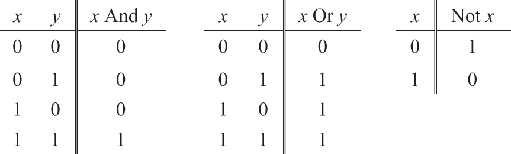

Figure 1.1    Three elementary Boolean functions.

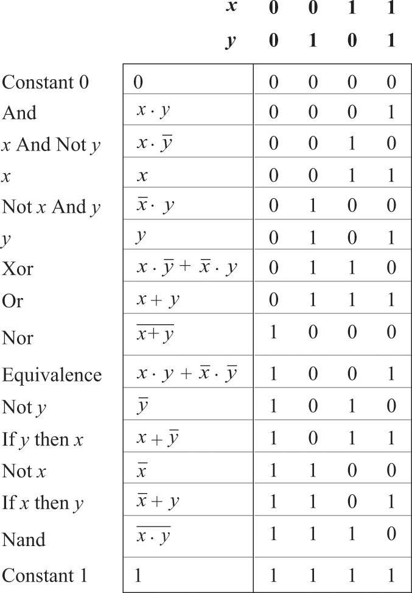

Figure 1.2    All the Boolean functions of two binary variables. In general, the number of Boolean functions spanned by n binary variables (here ) is  (that’s a lot of Boolean functions).

Figure 1.2 begs the question: What makes And, Or, and Not more interesting, or privileged, than any other subset of Boolean operators? The short answer is that indeed there is nothing special about And, Or, and Not. A deeper answer is that various subsets of logical operators can be used for expressing any Boolean function, and {And, Or, Not} is one such subset. If you find this claim impressive, consider this: any one of these three basic operators can be expressed using yet another operator—Nand. Now, that’s impressive! It follows that any Boolean function can be realized using Nand gates only. Appendix 1, which is an optional reading, provides a proof of this remarkable claim.

### Boolean Functions

Every Boolean function can be defined using two alternative representations. First, we can define the function using a truth table, as we do in figure 1.3. For each one of the 2n possible tuples of variable values  (here ), the table lists the value of f . In addition to this data-driven definition, we can also define Boolean functions using Boolean expressions, for example,  And Not (z)

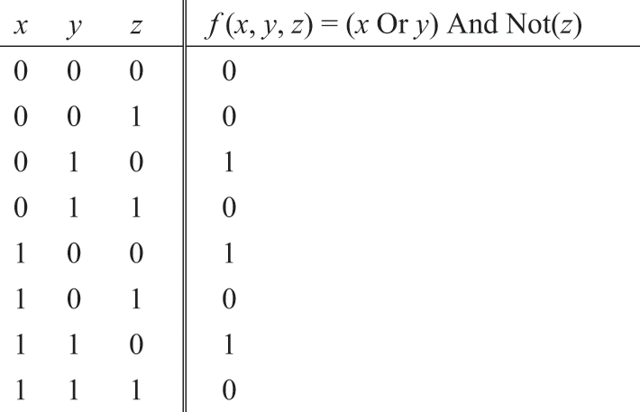

Figure 1.3    Truth table and functional definitions of a Boolean function (example).

How can we verify that a given Boolean expression is equivalent to a given truth table? Let’s use figure 1.3 as an example. Starting with the first row, we compute f (0, 0, 0), which is (0 Or 0) And Not (0). This expression evaluates to 0, the same value listed in the truth table. So far so good. A similar equivalence test can be applied to every row in the table—a rather tedious affair. Instead of using this laborious bottom-up proof technique, we can prove the equivalence top-down, by analyzing the Boolean expression (x Or y) And Not (z). Focusing on the left-hand side of the And operator, we observe that the overall expression evaluates to 1 only when ((x is 1) Or (y is 1)). Turning to the right-hand side of the And operator, we observe that the overall expression evaluates to 1 only when (z is 0). Putting these two observations together, we conclude that the expression evaluates to 1 only when (((x is 1) Or (y is 1)) And (z is 0)). This pattern of 0’s and 1’s occurs only in rows 3, 5, and 7 of the truth table, and indeed these are the only rows in which the table’s rightmost column contains a 1.

### Truth Tables and Boolean Expressions

Given a Boolean function of n variables represented by a Boolean expression, we can always construct from it the function’s truth table. We simply compute the function for every set of values (row) in the table. This construction is laborious, and obvious. At the same time, the dual construction is not obvious at all: Given a truth table representation of a Boolean function, can we always synthesize from it a Boolean expression for the underlying function? The answer to this intriguing question is yes. A proof can be found in appendix 1.

When it comes to building computers, the truth table representation, the Boolean expression, and the ability to construct one from the other are all highly relevant. For example, suppose that we are called to build some hardware for sequencing DNA data and that our domain expert biologist wants to describe the sequencing logic using a truth table. Our job is to realize this logic in hardware. Taking the given truth table data as a point of departure, we can synthesize from it a Boolean expression that represents the underlying function. After simplifying the expression using Boolean algebra, we can proceed to implement it using logic gates, as we’ll do later in the chapter. To sum up, a truth table is often a convenient means for describing some states of nature, whereas a Boolean expression is a convenient formalism for realizing this description in silicon. The ability to move from one representation to the other is one of the most important practices of hardware design.

We note in passing that although the truth table representation of a Boolean function is unique, every Boolean function can be represented by many different yet equivalent Boolean expressions, and some will be shorter and easier to work with. For example, the expression (Not (x And y) And (Not (x) Or y) And (Not (y) Or y)) is equivalent to the expression Not (x). We see that the ability to simplify a Boolean expression is the first step toward hardware optimization. This is done using Boolean algebra and common sense, as illustrated in appendix 1.

## 1.2 Logic Gates

A gate is a physical device that implements a simple Boolean function. Although most digital computers today use electricity to realize gates and represent binary data, any alternative technology permitting switching and conducting capabilities can be employed. Indeed, over the years, many hardware implementations of Boolean functions were created, including magnetic, optical, biological, hydraulic, pneumatic, quantum-based, and even domino-based mechanisms (many of these implementations were proposed as whimsical “can do” feats). Today, gates are typically implemented as transistors etched in silicon, packaged as chips. In Nand to Tetris we use the words chip and gate interchangeably, tending to use the latter for simple instances of the former.

The availability of alternative switching technologies, on the one hand, and the observation that Boolean algebra can be used to abstract the behavior of logic gates, on the other, is extremely important. Basically, it implies that computer scientists don’t have to worry about physical artifacts like electricity, circuits, switches, relays, and power sources. Instead, computer scientists are content with the abstract notions of Boolean algebra and gate logic, trusting blissfully that someone else—physicists and electrical engineers—will figure out how to actually realize them in hardware. Hence, primitive gates like those shown in figure 1.4 can be viewed as black box devices that implement elementary logical operations in one way or another—we don’t care how. The use of Boolean algebra for analyzing the abstract behavior of logic gates was articulated in 1937 by Claude Shannon, leading to what is sometimes described as the most important M.Sc. thesis in computer science.

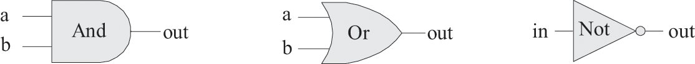

Figure 1.4    Standard gate diagrams of three elementary logic gates.

### Primitive and Composite Gates

Since all logic gates have the same input and output data types (0’s and 1’s), they can be combined, creating composite gates of arbitrary complexity. For example, suppose we are asked to implement the three-way Boolean function And (a, b, c), which returns 1 when every one of its inputs is 1, and 0 otherwise. Using Boolean algebra, we can begin by observing that  or, using prefix notation, And  (And (a, b), c). Next, we can use this result to construct the composite gate depicted in figure 1.5.

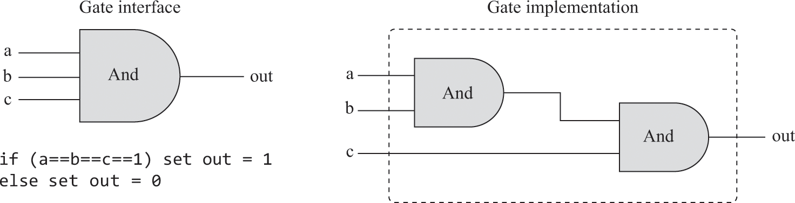

Figure 1.5    Composite implementation of a three-way And gate. The rectangular dashed outline defines the boundary of the gate interface.

We see that any given logic gate can be viewed from two different perspectives: internal and external. The right side of figure 1.5 gives the gate’s internal architecture, or implementation, whereas the left side shows the gate interface, namely, its input and output pins and the behavior that it exposes to the outside world. The internal view is relevant only to the gate builder, whereas the external view is the right level of detail for designers who wish to use the gate as an abstract, off-the-shelf component, without paying attention to its implementation.

Let us consider another logic design example: Xor. By definition, Xor (a, b) is 1 exactly when either a is 1 and b is 0 or a is 0 and b is 1. Said otherwise,  Xor(a,b) = Or(And(Not (a), b)). This definition is implemented in the logic design shown in figure 1.6.

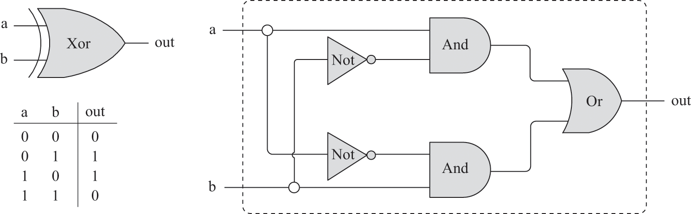

Figure 1.6    Xor gate interface (left) and a possible implementation (right).

Note that the interface of any given gate is unique: there is only one way to specify it, and this is normally done using a truth table, a Boolean expression, or a verbal specification. This interface, however, can be realized in many different ways, and some will be more elegant and efficient than others. For example, the Xor implementation shown in figure 1.6 is one possibility; there are more efficient ways to realize Xor, using less logic gates and less inter-gate connections. Thus, from a functional standpoint, the fundamental requirement of logic design is that the gate implementation will realize its stated interface, one way or another. From an efficiency standpoint, the general rule is to try to use as few gates as possible, since fewer gates imply less cost, less energy, and faster computation.

To sum up, the art of logic design can be described as follows: Given a gate abstraction (also referred to as specification, or interface), find an efficient way to implement it using other gates that were already implemented.

### 1.3 Hardware Construction

We are now in a position to discuss how gates are actually built. Let us start with an intentionally naïve example. Suppose we open a chip fabrication shop in our home garage. Our first contract is to build a hundred Xor gates. Using the order’s down payment, we purchase a soldering gun, a roll of copper wire, and three bins labeled “And gates,” “Or gates,” and “Not gates,” each containing many identical copies of these elementary logic gates. Each of these gates is sealed in a plastic casing that exposes some input and output pins, as well as a power supply port. Our goal is to realize the gate diagram shown in figure 1.6 using this hardware.

We begin by taking two And gates, two Not gates, and one Or gate and mounting them on a board, according to the figure’s layout. Next, we connect the chips to one another by running wires among them and soldering the wire ends to the respective input/output pins.

Now, if we follow the gate diagram carefully, we will end up having three exposed wire ends. We then solder a pin to each one of these wire ends, seal the entire device (except for the three pins) in a plastic casing, and label it “Xor.” We can repeat this assembly process many times over. At the end of the day, we can store all the chips that we’ve built in a new bin and label it “Xor gates.” If we wish to construct some other chips in the future, we’ll be able to use these Xor gates as black box building blocks, just as we used the And, Or, and Not gates before.

As you have probably sensed, the garage approach to chip production leaves much to be desired. For starters, there is no guarantee that the given chip diagram is correct. Although we can prove correctness in simple cases like Xor, we cannot do so in many realistically complex chips. Thus, we must settle for empirical testing: build the chip, connect it to a power supply, activate and deactivate the input pins in various configurations, and hope that the chip’s input/output behavior delivers the desired specification. If the chip fails to do so, we will have to tinker with its physical structure—a rather messy affair. Further, even if we do come up with a correct and efficient design, replicating the chip assembly process many times over will be a time-consuming and error-prone affair. There must be a better way!

#### 1.3.1 Hardware Description Language

Today, hardware designers no longer build anything with their bare hands. Instead, they design the chip architecture using a formalism called Hardware Description Language, or HDL. The designer specifies the chip logic by writing an HDL program, which is then subjected to a rigorous battery of tests. The tests are carried out virtually, using computer simulation: A special software tool, called a hardware simulator, takes the HDL program as input and creates a software representation of the chip logic. Next, the designer can instruct the simulator to test the virtual chip on various sets of inputs. The simulator computes the chip outputs, which are then compared to the desired outputs, as mandated by the client who ordered the chip built.

In addition to testing the chip’s correctness, the hardware designer will typically be interested in a variety of parameters such as speed of computation, energy consumption, and the overall cost implied by the proposed chip implementation. All these parameters can be simulated and quantified by the hardware simulator, helping the designer optimize the design until the simulated chip delivers desired cost/performance levels.

Thus, using HDL, one can completely plan, debug, and optimize an entire chip before a single penny is spent on physical production. When the performance of the simulated chip satisfies the client who ordered it, an optimized version of the HDL program can become the blueprint from which many copies of the physical chip can be stamped in silicon. This final step in the chip design process—from an optimized HDL program to mass production—is typically outsourced to companies that specialize in robotic chip fabrication, using one switching technology or another.

Example: Building an Xor Gate: The remainder of this section gives a brief introduction to HDL, using an Xor gate example; a detailed HDL specification can be found in appendix 2.

Let us focus on the bottom left of figure 1.7. An HDL definition of a chip consists of a header section and a parts section. The header section specifies the chip interface, listing the chip name and the names of its input and output pins. The PARTS section describes the chip-parts from which the chip architecture is made. Each chip-part is represented by a single statement that specifies the part name, followed by a parenthetical expression that specifies how it is connected to other parts in the design. Note that in order to write such statements, the HDL programmer must have access to the interfaces of all the underlying chip-parts: the names of their input and output pins, as well as their intended operation. For example, the programmer who wrote the HDL program listed in figure 1.7 must have known that the input and output pins of the Not gate are named in and out and that those of the And and Or gates are named a, b, and out. (The APIs of all the chips used in Nand to Tetris are listed in appendix 4).

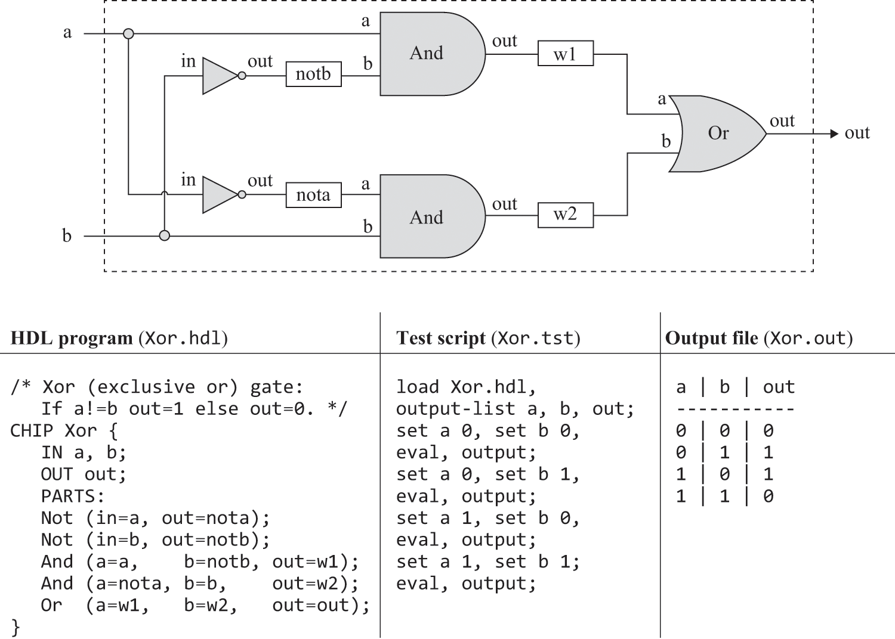

Figure 1.7    Gate diagram and HDL implementation of the Boolean function Xor  (And (a, Not (b)), And (Not (a), b)), used as an example. A test script and an output file generated by the test are also shown. Detailed descriptions of HDL and the testing language are given in appendices 2 and 3, respectively.

Inter-part connections are specified by creating and connecting internal pins, as needed. For example, consider the bottom of the gate diagram, where the output of a Not gate is piped into the input of a subsequent And gate. The HDL code describes this connection by the pair of statements Not(…, out=nota) and And(a=nota, …). The first statement creates an internal pin (outbound connection) named nota and pipes the value of the out pin into it. The second statement pipes the value of nota into the a input of an And gate. Two comments are in order here. First, internal pins are created “automatically” the first time they appear in an HDL program. Second, pins may have an unlimited fan-out. For example, in figure 1.7, each input is simultaneously fed into two gates. In gate diagrams, multiple connections are described by drawing them, creating forked patterns. In HDL programs, the existence of forks is inferred from the code.

The HDL that we use in Nand to Tetris has a similar look and feel to industrial strength HDLs but is much simpler. Our HDL syntax is mostly self-explanatory and can be learned by seeing a few examples and consulting appendix 2, as needed.

**Testing**

Rigorous quality assurance mandates that chips be tested in a specific, replicable, and well-documented fashion. With that in mind, hardware simulators are typically designed to run test scripts, written in a scripting language. The test script listed in figure 1.7 is written in the scripting language understood by the Nand to Tetris hardware simulator.

Let us give a brief overview of this test script. The first two lines instruct the simulator to load the Xor.hdl program and get ready to print the values of selected variables. Next, the script lists a series of testing scenarios. In each scenario, the script instructs the simulator to bind the chip inputs to selected data values, compute the resulting output, and record the test results in a designated output file. In the case of simple gates like Xor, one can write an exhaustive test script that enumerates all the input values that the gate can possibly get. In this case, the resulting output file (right side of figure 1.7) provides a complete empirical test that the chip is well behaving. The luxury of such certitude is not feasible in more complex chips, as we will see later.

Readers who plan to build the Hack computer will be pleased to know that all the chips that appear in the book are accompanied by skeletal HDL programs and supplied test scripts, available in the Nand to Tetris software suite. Unlike HDL, which must be learned in order to complete the chip specifications, there is no need to learn our testing language. At the same time, you have to be able to read and understand the supplied test scripts. The scripting language is described in appendix 3, which can be consulted on a need-to-know basis

#### 1.3.2    Hardware Simulation

Writing and debugging HDL programs is similar to conventional software development. The main difference is that instead of writing code in a high-level language, we write it in HDL, and instead of compiling and running the code, we use a hardware simulator to test it. The hardware simulator is a computer program that knows how to parse and interpret HDL code, turn it into an executable representation, and test it according to supplied test scripts. There exist many such commercial hardware simulators in the market. The Nand to Tetris software suite includes a simple hardware simulator that provides all the necessary tools for building, testing, and integrating all the chips presented in the book, leading up to the construction of a general-purpose computer. Figure 1.8 illustrates a typical chip simulation session.

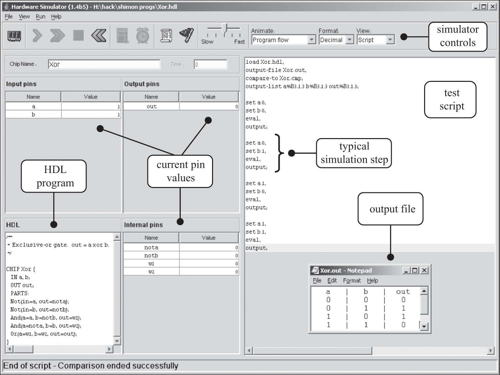

Figure 1.8    A screenshot of simulating an Xor chip in the supplied hardware simulator (other versions of this simulator may have a slightly different GUI). The simulator state is shown just after the test script has completed running. The pin values correspond to the last simulation step  Not shown in this screenshot is a compare file that lists the expected output of the simulation specified by this particular test script. Like the test script, the compare file is typically supplied by the client who wants the chip built. In this particular example, the output file generated by the simulation (bottom right of the figure) is identical to the supplied compare file.

### 1.4 Specification

We now turn to specify a set of logic gates that will be needed for building the chips of our computer system. These gates are ordinary, each designed to carry out a common Boolean operation. For each gate, we’ll focus on the gate interface (what the gate is supposed to do), delaying implementation details (how to build the gate’s functionality) to a later section.

### 1.4.1 NAND

The starting point of our computer architecture is the Nand gate, from which all other gates and chips will be built. The Nand gate realizes the following Boolean function:

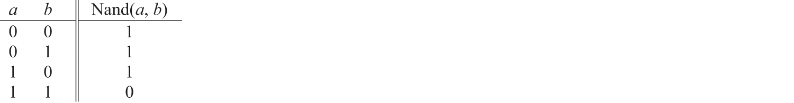

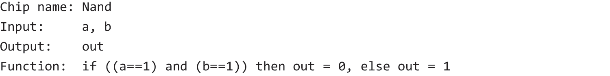

Throughout the book, chips are specified using the API style shown above. For each chip, the API specifies the chip name, the names of its input and output pins, the chip’s intended function or operation, and optional comments.

### 1.4.2 Basic Logic Gates

The logic gates that we present here are typically referred to as basic, since they come into play in the construction of more complex chips. The Not, And, Or, and Xor gates implement classical logical operators, and the multiplexer and demultiplexer gates provide means for controlling flows of information.

Not: Also known as inverter, this gate outputs the opposite value of its input’s value. Here is the API:

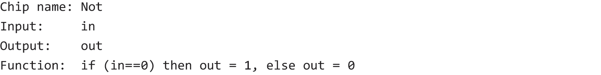

And: Returns 1 when both its inputs are 1, and 0 otherwise:

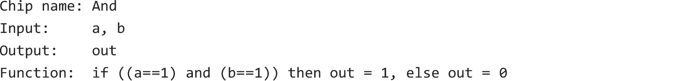

Or: Returns 1 when at least one of its inputs is 1, and 0 otherwise:

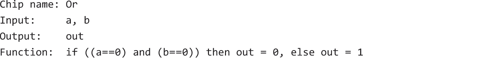

Xor: Also known as exclusive or, this gate returns 1 when exactly one of its inputs is 1, and 0 otherwise:

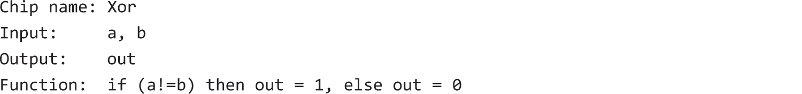

Multiplexer: A multiplexer is a three-input gate (see figure 1.9). Two input bits, named a and b, are interpreted as data bits, and a third input bit, named sel, is interpreted as a selection bit. The multiplexer uses sel to select and output the value of either a or b. Thus, a sensible name for this device could have been selector. The name multiplexer was adopted from communications systems, where extended versions of this device are used for serializing (multiplexing) several input signals over a single communications channel

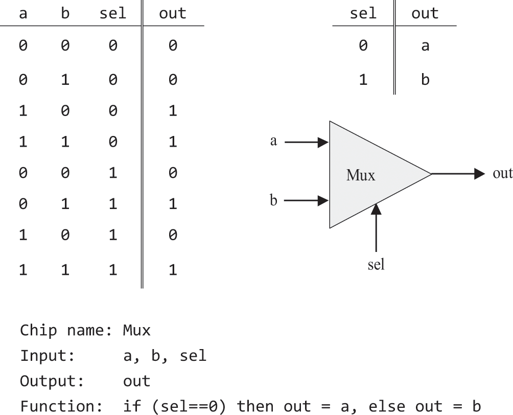

Figure 1.9    Multiplexer. The table at the top right is an abbreviated version of the truth table.

Demultiplexer: A demultiplexer performs the opposite function of a multiplexer: it takes a single input value and routes it to one of two possible outputs, according to a selector bit that selects the destination output. The other output is set to 0. Figure 1.10 gives the API.

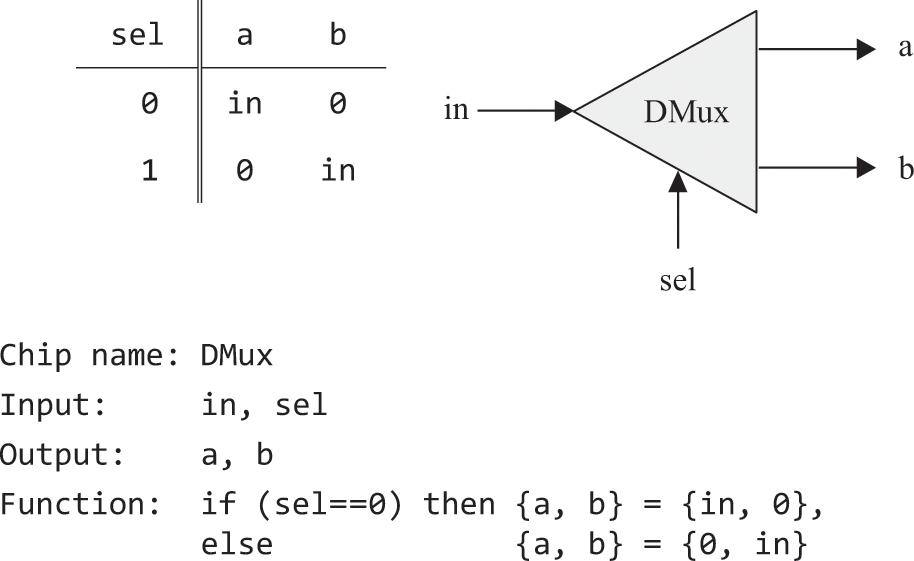

#### 1.4.3 Multi-Bit Versions of Basic Gates

Computer hardware is often designed to process multi-bit values—for example, computing a bitwise And function on two given 16-bit inputs. This section describes several 16-bit logic gates that will be needed for constructing our target computer platform. We note in passing that the logical architecture of these n-bit gates is the same, irrespective of n’s value (e.g., 16, 32, or 64 bits). HDL programs treat multi-bit values like single-bit values, except that the values can be indexed in order to access individual bits. For example, if in and out represent 16-bit values, then out sets the 3rd bit of out to the value of the 5th bit of in. The bits are indexed from right to left, the rightmost bit being the 0’th bit and the leftmost bit being the 15’th bit (in a 16-bit setting).

Multi-bit Not: An n-bit Not gate applies the Boolean operation Not to every one of the bits in its n-bit input:

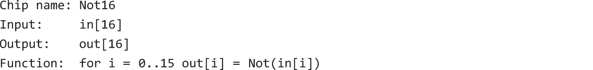

Multi-bit And: An n-bit And gate applies the Boolean operation And to every respective pair in its two n-bit inputs:

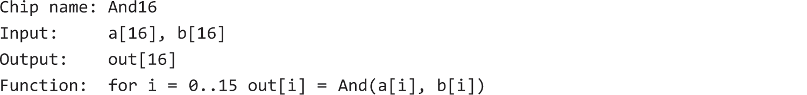

Multi-bit Or: An n-bit Or gate applies the Boolean operation Or to every respective pair in its two n-bit inputs:

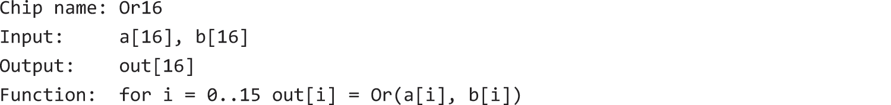

Multi-bit multiplexer: An n-bit multiplexer operates exactly the same as a basic multiplexer, except that its inputs and output are n-bits wide:

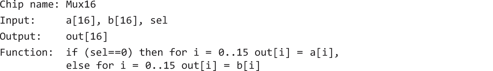

#### 1.4.4 Multi-Way Versions of Basic Gates

Logic gates that operate on one or two inputs have natural generalization to multi-way variants that operate on more than two inputs. This section describes a set of multi-way gates that will be used subsequently in various chips in our computer architecture.

Multi-way Or: An m-way Or gate outputs 1 when at least one of its m input bits is 1, and 0 otherwise. We will need an 8-way variant of this gate:

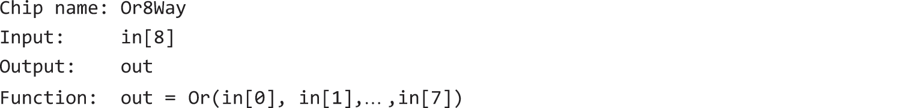

Multi-way/Multi-bit multiplexer: An m-way n-bit multiplexer selects one of its m n-bit inputs, and outputs it to its n-bit output. The selection is specified by a set of k selection bits, where  Here is the API of a 4-way multiplexer:

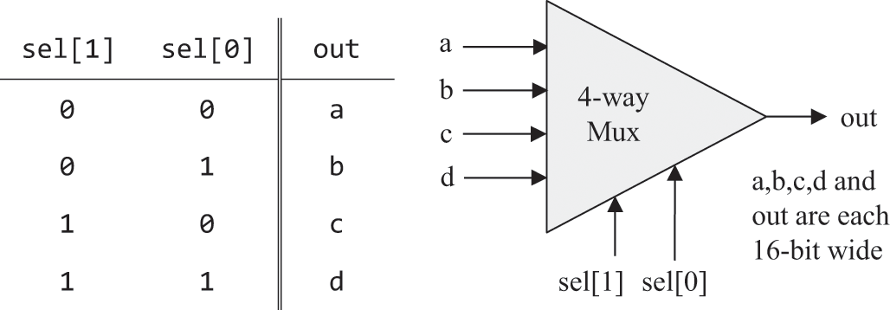

Our target computer platform requires two variants of this chip: a 4-way 16-bit multiplexer and an 8-way 16-bit multiplexer:

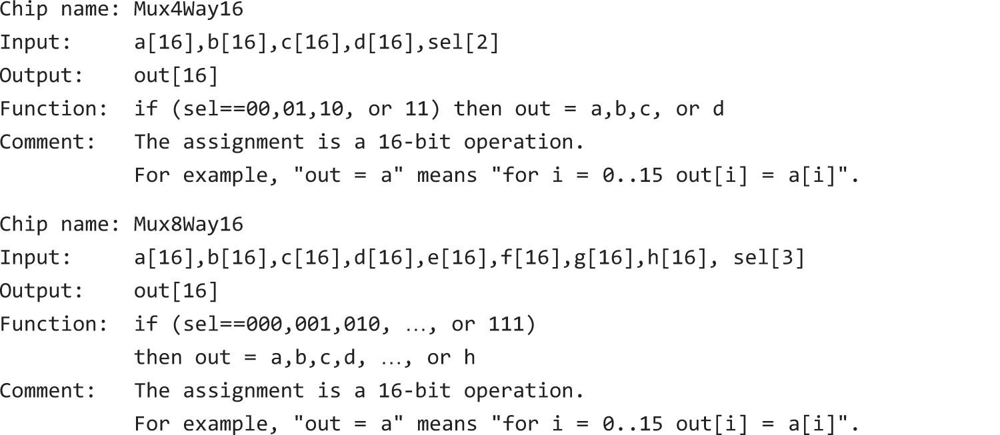

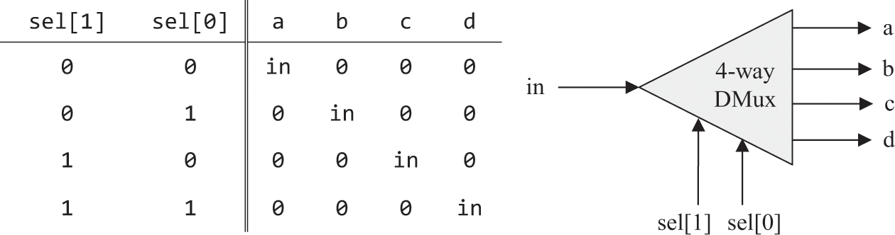

Multi-way/Multi-bit demultiplexer: An m-way n-bit demultiplexer routes its single n-bit input to one of its m n-bit outputs. The other outputs are set to 0. The selection is specified by a set of k selection bits, where  Here is the API of a 4-way demultiplexer:

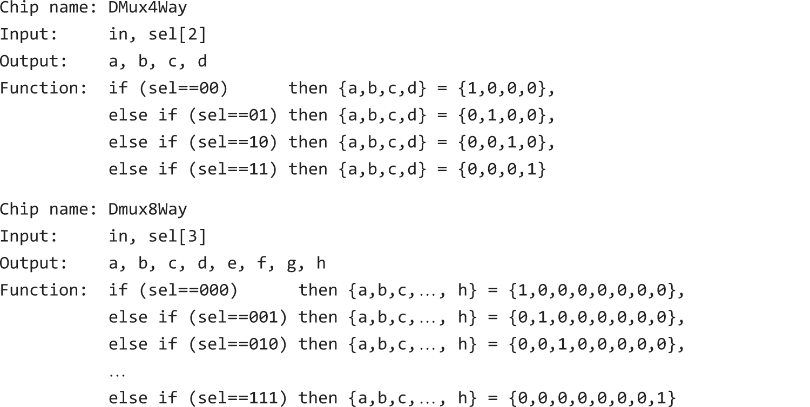

### 1.5 Implementation

The previous section described the specifications, or interfaces, of a family of basic logic gates. Having described the what, we now turn to discuss the how. In particular, we’ll focus on two general approaches to implementing logic gates: behavioral simulation and hardware implementation. Both approaches play important roles in all our hardware construction projects.

#### 1.5.1 Behavioral Simulation
The chip descriptions presented thus far are strictly abstract. It would have been nice if we could experiment with these abstractions hands-on, before setting out to build them in HDL. How can we possibly do so?

Well, if all we want to do is interact with the chips’ behavior, we don’t have to go through the trouble of building them in HDL. Instead, we can opt for a much simpler implementation, using conventional programming. For example, we can use some object-oriented language to create a set of classes, each implementing a generic chip. We can write class constructors for creating chip instances and eval methods for evaluating their logic, and we can have the classes interact with each other so that high-level chips can be defined in terms of lower-level ones. We could then add a nice graphical user interface that enables putting different values in the chip inputs, evaluating their logic, and observing the chip outputs. This software-based technique, called behavioral simulation, makes a lot of sense. It enables experimenting with chip interfaces before starting the laborious process of building them in HDL.

The Nand to Tetris hardware simulator provides exactly such a service. In addition to simulating the behavior of HDL programs, which is its main purpose, the simulator features built-in software implementations of all the chips built in the Nand to Tetris hardware projects. The built-in version of each chip is implemented as an executable software module, invoked by a skeletal HDL program that provides the chip interface. For example, here is the HDL program that implements the built-in version of the Xor chip:

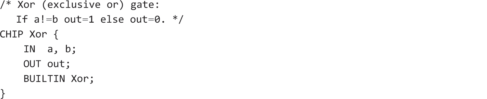

Compare this to the HDL program listed in figure 1.7. First, note that regular chips and built-in chips have precisely the same interface. Thus, they provide exactly the same functionality. In the built-in implementation though, the PARTS section is replaced with the single statement BUILTIN Xor. This statement informs the simulator that the chip is implemented by Xor.class. This class file, like all the Java class files that implement built-in chips, is located in the folder nand2tetris/tools/builtIn.

We note in passing that realizing logic gates using high-level programming is not difficult, and that’s another virtue of behavioral simulation: it’s inexpensive and quick. At some point, of course, hardware engineers must do the real thing, which is implementing the chips not as software artifacts but rather as HDL programs that can be committed to silicon. That’s what we’ll do next.

#### 1.5.2 Hardware Implementation

This section gives guidelines on how to implement the fifteen logic gates described in this chapter. As a rule in this book, our implementation guidelines are intentionally brief. We give just enough insights to get started, leaving you the pleasure of discovering the rest of the gate implementations yourself.

Nand: Since we decided to base our hardware on elementary Nand gates, we treat Nand as a primitive gate whose functionality is given externally. The supplied hardware simulator features a built-in implementation of Nand, and thus there is no need to implement it.

Not: Can be implemented using a single Nand gate. Tip: Inspect the Nand truth table, and ask yourself how the Nand inputs can be arranged so that a single input signal, 0, will cause the Nand gate to output 1, and a single input signal, 1, will cause it to output 0.

And: Can be implemented from the two previously discussed gates.

Or / Xor: The Boolean function Or can be defined using the Boolean functions And and Not. The Boolean function Xor can be defined using And, Not, and Or.

Multiplexer / Demultiplexer: Can be implemented using previously built gates.

Multi-bit Not / And / Or gates: Assuming that you’ve already built the basic versions of these gates, the implementation of their n-ary versions is a matter of arranging arrays of n basic gates and having each gate operate separately on its single-bit inputs. The resulting HDL code will be somewhat boring and repetitive (using copy-paste), but it will carry its weight when these multi-bit gates are used in the construction of more complex chips, later in the book.

Multi-bit multiplexer: The implementation of an n-ary multiplexer is a matter of feeding the same selection bit to every one of n binary multiplexers. Again, a boring construction task resulting in a very useful chip.

Multi-way gates: Implementation tip: Think forks.

#### 1.5.3 Built-In Chips
As we pointed out when we discussed behavioral simulation, our hardware simulator provides software-based, built-in implementations of most of the chips described in the book. In Nand to Tetris, the most celebrated built-in chip is of course Nand: whenever you use a Nand chip-part in an HDL program, the hardware simulator invokes the built-in tools/builtIn/Nand.hdl implementation. This convention is a special case of a more general chip invocation strategy: whenever the hardware simulator encounters a chip-part, say, Xxx, in an HDL program, it looks up the file Xxx.hdl in the current folder; if the file is found, the simulator evaluates its underlying HDL code. If the file is not found, the simulator looks it up in the tools/builtIn folder. If the file is found there, the simulator executes the chip’s built-in implementation; otherwise, the simulator issues an error message and terminates the simulation.

This convention comes in handy. For example, suppose you began implementing a Mux.hdl program, but, for some reason, you did not complete it. This could be an annoying setback, since, in theory, you cannot continue building chips that use Mux as a chip-part. Fortunately, and actually by design, this is where built-in chips come to the rescue. All you have to do is rename your partial implementation Mux1.hdl, for example. Each time the hardware simulator is called to simulate the functionality of a Mux chip-part, it will fail to find a Mux.hdl file in the current folder. This will cause behavioral simulation to kick in, forcing the simulator to use the built-in Mux version instead. Exactly what we want! At a later stage you may want to go back to Mux1.hdl and resume working on its implementation. At this point you can restore its original file name, Mux.hdl, and continue from where you left off.

### 1.6 Project

This section describes the tools and resources needed for completing project 1 and gives recommended implementation steps and tips.

Objective: Implement all the logic gates presented in the chapter. The only building blocks that you can use are primitive Nand gates and the composite gates that you will gradually build on top of them.

Resources: We assume that you’ve already downloaded the Nand to Tetris zip file, containing the book’s software suite, and that you’ve extracted it into a folder named nand2tetris on your computer. If that is the case, then the nand2tetris/tools folder on your computer contains the hardware simulator discussed in this chapter. This program, along with a plain text editor, are the only tools needed for completing project 1 as well as all the other hardware projects described in the book.

The fifteen chips mentioned in this chapter, except for Nand, should be implemented in the HDL language described in appendix 2. For each chip Xxx, we provide a skeletal Xxx.hdl program (sometimes called a stub file) with a missing implementation part. In addition, for each chip we provide an Xxx.tst script that tells the hardware simulator how to test it, along with an Xxx.cmp compare file that lists the correct output that the supplied test is expected to generate. All these files are available in your nand2tetris/projects/01 folder. Your job is to complete and test all the Xxx.hdl files in this folder. These files can be written and edited using any plain text editor.

Contract: When loaded into the hardware simulator, your chip design (modified .hdl program), tested on the supplied .tst file, should produce the outputs listed in the supplied .cmp file. If the actual outputs generated by the simulator disagree with the desired outputs, the simulator will stop the simulation and produce an error message.

Steps: We recommend proceeding in the following order:

0.  The hardware simulator needed for this project is available in nand2tetris/tools.
1.  Consult appendix 2 (HDL), as needed.
2.  Consult the Hardware Simulator Tutorial (available at www.nand2tetris.org), as needed.
3.  Build and simulate all the chips listed in nand2tetris/projects/01.

General Implementation Tips
(We use the terms gate and chip interchangeably.)

Each gate can be implemented in more than one way. The simpler the implementation, the better. As a general rule, strive to use as few chip-parts as possible.
Although each chip can be implemented directly from Nand gates only, we recommend always using composite gates that were already implemented. See the previous tip.
There is no need to build “helper chips” of your own design. Your HDL programs should use only the chips mentioned in this chapter.
Implement the chips in the order in which they appear in the chapter. If, for some reason, you don’t complete the HDL implementation of some chip, you can still use it as a chip-part in other HDL programs. Simply rename the chip file, or remove it from the folder, causing the simulator to use its built-in version instead.
A web-based version of project 1 is available at www.nand2tetris.org.

### 1.7 Perspective
This chapter specified a set of basic logic gates that are widely used in computer architectures. In chapters 2 and 3 we will use these gates for building our processing and storage chips, respectively. These chips, in turn, will be later used for constructing the central processing unit and the memory devices of our computer.

Although we have chosen to use Nand as our basic building block, other logic gates can be used as possible points of departure. For example, you can build a complete computer platform using Nor gates only or, alternatively, a combination of And, Or, and Not gates. These constructive approaches to logic design are theoretically equivalent, just like the same geometry can be founded on alternative sets of agreed-upon axioms. In principle, if electrical engineers or physicists can come up with efficient and low-cost implementations of logic gates using any technology that they see fit, we will happily use them as primitive building blocks. The reality, though, is that most computers are built from either Nand or Nor gates.

Throughout the chapter, we paid no attention to efficiency and cost considerations, such as energy consumption or the number of wire crossovers implied by our HDL programs. Such considerations are critically important in practice, and a great deal of computer science and technology expertise focuses on optimizing them. Another issue we did not address is physical aspects, for example, how primitive logic gates can be built from transistors embedded in silicon or from other switching technologies. There are of course several such implementation options, each having its own characteristics (speed, energy consumption, production cost, and so on). Any nontrivial coverage of these issues requires venturing into areas outside computer science, like electrical engineering and solid-state physics.

The next chapter describes how bits can be used to represent binary numbers and how logic gates can be used to realize arithmetic operations. These capabilities will be based on the elementary logic gates built in this chapter.
