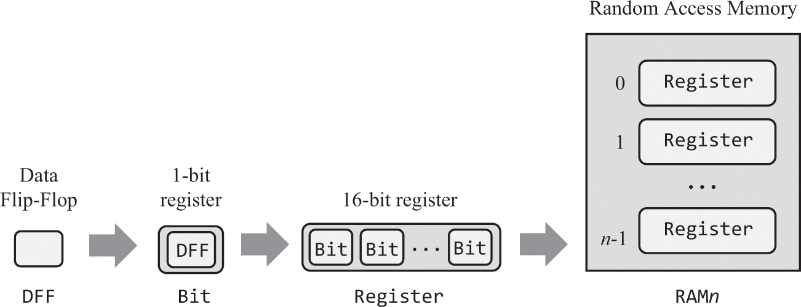
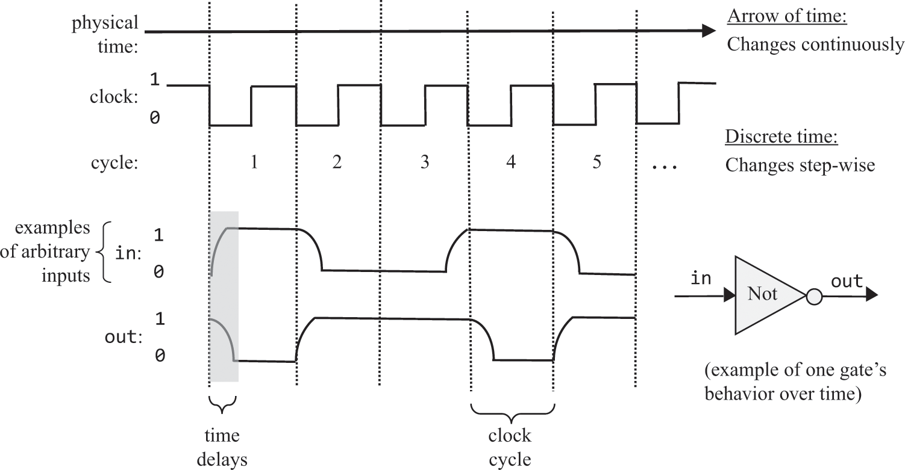
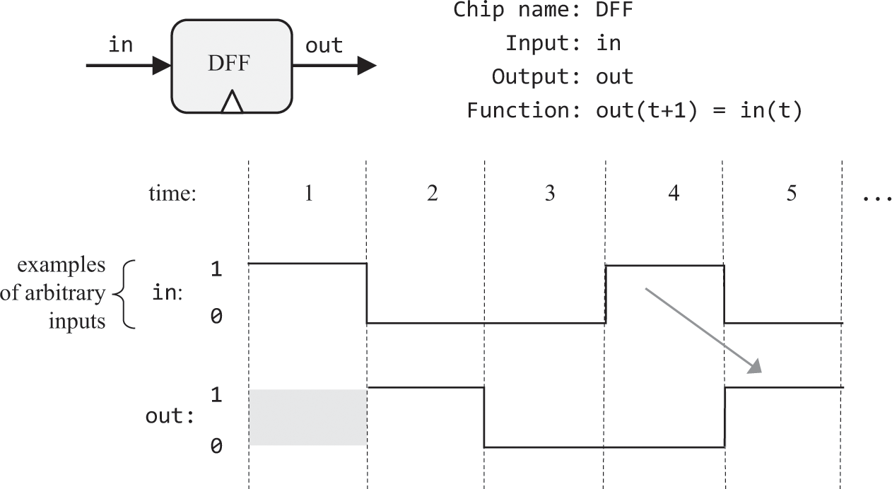
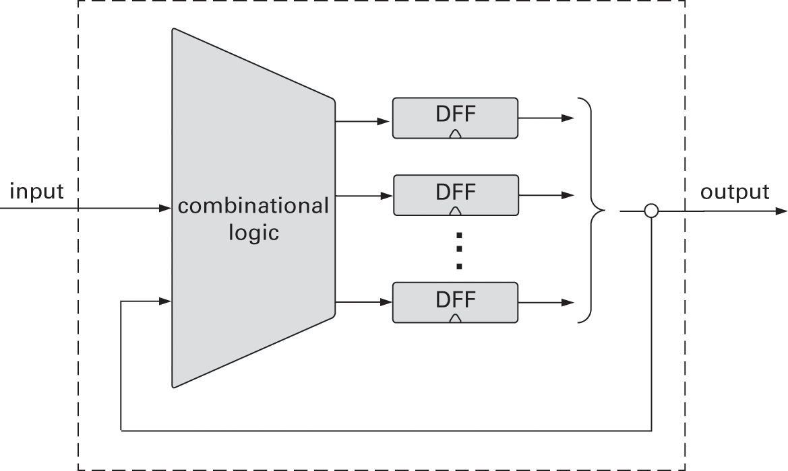
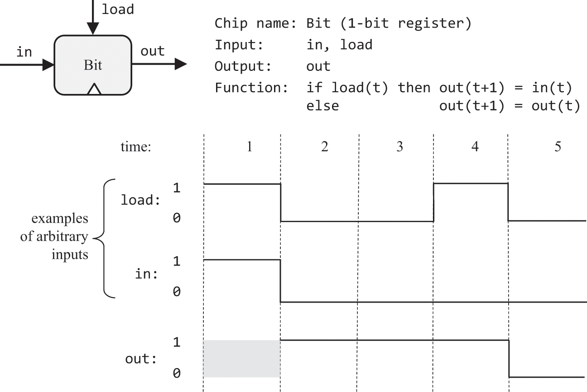
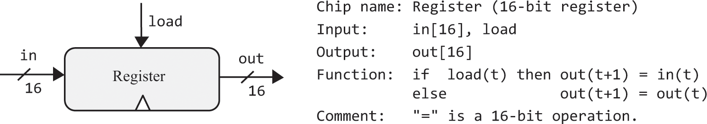
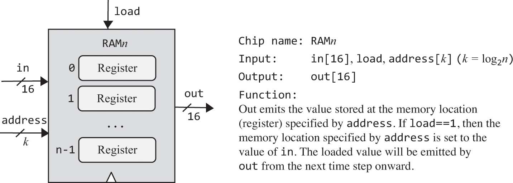
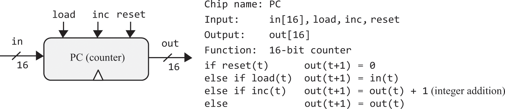
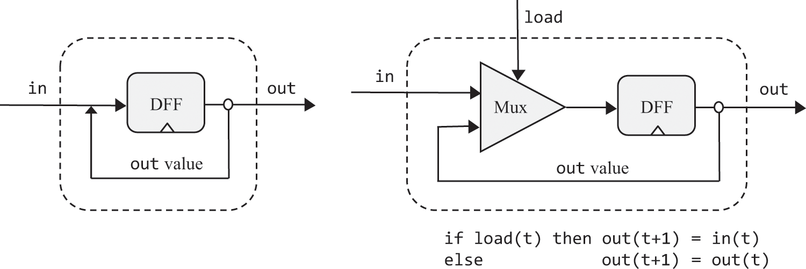
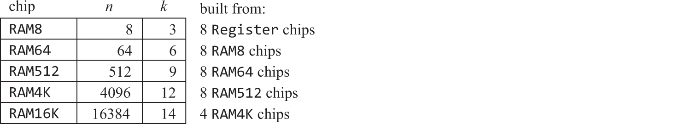

# 3 Memory

> It’s a poor sort of memory that only works backward.

—Lewis Carroll (1832–1898)

Consider the high-level operation  In chapter 2 we showed how logic gates can be utilized for representing numbers and for computing simple arithmetic expressions like  We now turn to discuss how logic gates can be used to store values over time—in particular, how a variable like x can be set to “contain” a value and persist it until we set it to another value. To do so, we’ll develop a new family of memory chips.

So far, all the chips that we built in chapters 1 and 2, culminating with the ALU, were time independent. Such chips are sometimes called combinational: they respond to different combinations of their inputs without delay, except for the time it takes their inner chip-parts to complete the computation. In this chapter we introduce and build sequential chips. Unlike combinational chips, which are oblivious to time, the outputs of sequential chips depend not only on the inputs in the current time but also on inputs and outputs that have been processed previously.

Needless to say, the notions of current and previous go hand in hand with the notion of time: you remember now what was committed to memory before. Thus, before we start talking about memory, we must first figure out how to use logic to model the progression of time. This can be done using a clock that generates an ongoing train of binary signals that we call tick and tock. The time between the beginning of a tick and the end of the subsequent tock is called a cycle, and these cycles will be used to regulate the operations of all the memory chips used by the computer.

Following a brief, user-oriented introduction to memory devices, we will present the art of sequential logic, which we will use for building time-dependent chips. We will then set out to build registers, RAM devices, and counters. These memory devices, along with the arithmetic devices built in chapter 2, comprise all the chips needed for building a complete, general-purpose computer system—a challenge that we will take up in chapter 5.

# 3.1 Memory Devices

Computer programs use variables, arrays, and objects—abstractions that persist data over time. Hardware platforms support this ability by offering memory devices that know how to maintain state. Because evolution gave humans a phenomenal electro-chemical memory system, we tend to take for granted the ability to remember things over time. However, this ability is hard to implement in classical logic, which is aware of neither time nor state. Thus, to get started, we must first find a way to model the progression of time and endow logic gates with the ability to maintain state and respond to time changes.

We will approach this challenge by introducing a clock and an elementary, time-dependent logic gate that can flip and flop between two stable states: representing 0 and representing 1. This gate, called data flip-flop (DFF), is the fundamental building block from which all memory devices will be built. In spite of its central role, though, the DFF is a low-profile, inconspicuous gate: unlike registers, RAM devices, and counters, which play prominent roles in computer architectures, DFFs are used implicitly, as low-level chip-parts embedded deep within other memory devices.

The fundamental role of the DFF is seen clearly in figure 3.1, where it serves as the foundation of the memory hierarchy that we are about to build. We will show how DFFs can be used to create 1-bit registers and how n such registers can be lashed together to create an n-bit register. Next, we’ll construct a RAM device containing an arbitrary number of such registers. Among other things, we’ll develop a means for addressing, that is, accessing by address, any randomly chosen register from the RAM directly and instantaneously.

Figure 3.1    The memory hierarchy built in this chapter.

Before setting out to build these chips, though, we’ll present a methodology and tools that enable modeling the progression of time and maintaining state over time.

# 3.2 Sequential Logic

All the chips discussed in chapters 1 and 2 were based on classical logic, which is time independent. In order to develop memory devices, we need to extend our gate logic with the ability to respond not only to input changes but also to the ticking of a clock: we remember the meaning of the word dog in time t since we remembered it in time  all the way back to the point of time when we first committed it to memory. In order to develop this temporal ability to maintain state, we must extend our computer architecture with a time dimension and build tools that handle time using Boolean functions.

## 3.2.1 Time Matters
So far in our Nand to Tetris journey, we have assumed that chips respond to their inputs instantaneously: you input 7, 2, and “subtract” into the ALU, and … poof! the ALU output becomes 5. In reality, outputs are always delayed, due to at least two reasons. First, the inputs of the chips don’t appear out of thin air; rather, the signals that represent them travel from the outputs of other chips, and this travel takes time. Second, the computations that chips perform also take time; the more chip-parts the chip has—the more elaborate its logic—the more time it will take for the chip’s outputs to emerge fully formed from the chip’s circuitry.

Thus time is an issue that must be dealt with. As seen at the top of figure 3.2, time is typically viewed as a metaphorical arrow that progresses relentlessly forward. This progression is taken to be continuous: between every two time-points there is another time-point, and changes in the world can be infinitesimally small. This notion of time, which is popular among philosophers and physicists, is too deep and mysterious for computer scientists. Thus, instead of viewing time as a continuous progression, we prefer to break it into fixed-length intervals, called cycles. This representation is discrete, resulting in cycle 1, cycle 2, cycle 3, and so on. Unlike the continuous arrow of time, which has an infinite granularity, the cycles are atomic and indivisible: changes in the world occur only during cycle transitions; within cycles, the world stands still.

Figure 3.2    Discrete time representation: State changes (input and output values) are observed only during cycle transitions. Within cycles, changes are ignored.

Of course the world never stands still. However, by treating time discretely, we make a conscious decision to ignore continuous change. We are content to know the state of the world in cycle n, and then in cycle  but during each cycle the state is assumed to be—well, we don’t care. When it comes to building computer architectures, this discrete view of time serves two important design objectives. First, it can be used for neutralizing the randomness associated with communications and computation time delays. Second, it can be used for synchronizing the operations of different chips across the system, as we’ll see later.

To illustrate, let’s focus on the bottom part of figure 3.2, which tracks how a Not gate (used as an example) responds to arbitrarily chosen inputs. When we feed the gate with 1, it takes a while before the gate’s output stabilizes on 0. However, since the cycle duration is—by design—longer than the time delay, when we reach the cycle’s end, the gate output has already stabilized on 0. Since we probe the state of the world only at cycle ends, we don’t get to see the interim time delays; rather, it appears as if we fed the gate with 0, and poof! the gate responded with 1. If we make the same observations at the end of each cycle, we can generalize that when a Not gate is fed with some binary input x, it instantaneously outputs Not (x).

Thoughtful readers have probably noticed that for this scheme to work, the cycle’s length must be longer than the maximal time delays that can occur in the system. Indeed, cycle length is one of the most important design parameters of any hardware platform: When planning a computer, the hardware engineer chooses a cycle length that meets two design objectives. On the one hand, the cycle should be sufficiently long to contain, and neutralize, any possible time delay; on the other hand, the shorter the cycle, the faster the computer: if things happen only during cycle transitions, then obviously things happen faster when the cycles are shorter. To sum up, the cycle length is chosen to be slightly longer than the maximal time delay in any chip in the system. Following the tremendous progress in switching technologies, we are now able to create cycles as tiny as a billionth of a second, achieving remarkable computer speed.

Typically, the cycles are realized by an oscillator that alternates continuously between two phases labeled 0−1, low-high, or ticktock (as seen in figure 3.2). The elapsed time between the beginning of a tick and the end of the subsequent tock is called a cycle, and each cycle is taken to model one discrete time unit. The current clock phase (tick or tock) is represented by a binary signal. Using the hardware’s circuitry, the same master clock signal is simultaneously broadcast to every memory chip in the system. In every such chip, the clock input is funneled to the lower-level DFF gates, where it serves to ensure that the chip will commit to a new state, and output it, only at the end of the clock cycle.

#### 3.2.2 Flip-Flops

Memory chips are designed to “remember”, or store, information over time. The low-level devices that facilitate this storage abstraction are named flip-flop gates, of which there are several variants. In Nand to Tetris we use a variant named data flip-flop, or DFF, whose interface includes a single-bit data input and a single-bit data output (see top of figure 3.3). In addition, the DFF 

has a clock input that feeds from the master clock’s signal. Taken together, the data input and the clock input enable the DFF to implement the simple time-based behavior out where in and out are the gate’s input and output values, and t is the current time unit (from now on, we’ll use the terms “time unit” and “cycle” interchangeably). Let us not worry how this behavior is actually implemented. For now, we simply observe that at the end of each time unit, the DFF outputs the input value from the previous time unit.

Figure 3.3    The data flip-flop (top) and behavioral example (bottom). In the first cycle the previous input is unknown, so the DFF’s output is undefined. In every subsequent time unit, the DFF outputs the input from the previous time unit. Following gate diagramming conventions, the clock input is marked by a small triangle, drawn at the bottom of the gate icon.

Like Nand gates, DFF gates lie deep in the hardware hierarchy. As shown in figure 3.1, all the memory chips in the computer—registers, RAM units, and counters—are based, at bottom, on DFF gates. All these DFFs are connected to the same master clock, forming a huge distributed “chorus line.” At the end of each clock cycle, the outputs of all the DFFs in the computer commit to their inputs from the previous cycle. At all other times, the DFFs are latched, meaning that changes in their inputs have no immediate effect on their outputs. This conduction operation effects any one of the system’s numerous DFF gates many times per second (depending on the computer’s clock frequency).

Hardware implementations realize the time dependency using a dedicated clock bus that feeds the master clock signal simultaneously to all the DFF gates in the system. Hardware simulators emulate the same effect in software. In particular, the Nand to Tetris hardware simulator features a clock icon, enabling the user to advance the clock interactively, as well as tick and tock commands that can be used programmatically, in test scripts.

### 3.2.3 Combinational and Sequential Logic

All the chips that were developed in chapters 1 and 2, starting with the elementary logic gates and culminating with the ALU, were designed to respond only to changes that occur during the current clock cycle. Such chips are called time-independent chips, or combinational chips. The latter name alludes to the fact that these chips respond only to different combinations of their input values, while paying no attention to the progression of time.

In contrast, chips that are designed to respond to changes that occurred during previous time units (and possibly during the current time unit as well) are called sequential, or clocked. The most fundamental sequential gate is the DFF, and any chip that includes it, either directly or indirectly, is also said to be sequential. Figure 3.4 depicts a typical sequential logic configuration. The main element in this configuration is a set of one or more chips that include DFF chip-parts, either directly or indirectly. As shown in the figure, these sequential chips may also interact with combinational chips. The feedback loop enables the sequential chip to respond to inputs and outputs from the previous time unit. In combinational chips, where time is neither modeled nor recognized, the introduction of feedback loops is problematic: the output of the chip would depend on its input, which itself would depend on the output, and thus the output would depend on itself. Note, however, that there is no difficulty in feeding outputs back into inputs, as long as the feedback loop goes through a DFF gate: the DFF introduces an inherent time delay so that the output at time t does not depend on itself but rather on the output at time `t - 1`

Figure 3.4    Sequential logic design typically involves DFF gates that feed from, and connect to, combinational chips. This gives sequential chips the ability to respond to current as well as to previous inputs and outputs.

The time dependency of sequential chips has an important side effect that serves to synchronize the overall computer architecture. To illustrate, suppose we instruct the ALU to compute  where x is the output of a nearby register, and y is the output of a remote RAM register. Because of physical constraints like distance, resistance, and interference, the electric signals representing x and y will likely arrive at the ALU at different times. However, being a combinational chip, the ALU is insensitive to the concept of time—it continuously and happily adds up whichever data values happen to lodge at its inputs. Thus, it will take some time before the ALU’s output stabilizes to the correct  result. Until then, the ALU will generate garbage.

How can we overcome this difficulty? Well, if we use a discrete representation of time, we simply don’t care. All we have to do is ensure, when we build the computer’s clock, that the duration of the clock cycle will be slightly longer than the time it takes a bit to travel the longest distance from one chip to another, plus the time it takes to complete the most time-consuming within-chip calculation. This way, we are guaranteed that by the end of the clock cycle, the ALU’s output will be valid. This, in a nutshell, is the trick that turns a set of standalone hardware components into a well-synchronized system. We will have more to say about this master orchestration when we build the computer architecture in chapter 5.

### 3.3 Specification

We now turn to specify the memory chips that are typically used in computer architectures:

- data flip-flops (DFFs)
- registers (based on DFFs)
- RAM devices (based on registers)
- counters (based on registers)

As usual, we describe these chips abstractly. In particular, we focus on each chip’s interface: inputs, outputs, and function. How the chips deliver this functionality will be discussed in the Implementation section.

#### 3.3.1 Data Flip-Flop

The most elementary sequential device that we will use—the basic component from which all other memory chips will be constructed—is the data flip-flop. A DFF gate has a single-bit data input, a single-bit data output, a clock input, and a simple time-dependent behavior: `out(t) = in(t - 1)`

Usage: If we put a one-bit value in the DFF’s input, the DFF’s state will be set to this value, and the DFF’s output will emit it in the next time unit (see figure 3.3). This humble operation will prove most useful in the implementation of registers, which is described next.

#### 3.3.2 Registers

We present a single-bit register, named Bit, and a 16-bit register, named Register. The Bit chip is designed to store a single bit of information—0 or 1—over time. The chip interface consists of an in input that carries a data bit, a load input that enables the register for writes, and an out output that emits the current state of the register. The Bit API and input/output behavior are described in figure 3.5.

Figure 3.5    1-bit register. Stores and emits a 1-bit value until instructed to load a new value.

Figure 3.5 illustrates how the single-bit register behaves over time, responding to arbitrary examples of in and load inputs. Note that irrespective of the input value, as long as the load bit is not asserted, the register is latched, maintaining its current state.

The 16-bit Register chip behaves exactly the same as the Bit chip, except that it is designed to handle 16-bit values. Figure 3.6 gives the details.

Figure 3.6    16-bit Register. Stores and emits a 16-bit value until instructed to load a new value.

Usage: The Bit register and the 16-bit Register are used identically. To read the state of the register, probe the value of out. To set the register’s state to v, put v in the in input, and assert (put 1 into) the load bit. This will set the register’s state to v, and, from the next time unit onward, the register will commit to the new value, and its out output will start emitting it. We see that the Register chip fulfills the classical function of a memory device: it remembers and emits the last value that was written into it, until we set it to another value.

#### 3.3.3 Random Access Memory

A direct-access memory unit, also called Random Access Memory, or RAM, is an aggregate of n Register chips. By specifying a particular address (a number between 0 to ), each register in the RAM can be selected and made available for read/write operations. Importantly, the access time to any randomly selected memory register is instantaneous and independent of the register’s address and the size of the RAM. That’s what makes RAM devices so remarkably useful: even if they contain billions of registers, we can still access and manipulate each selected register directly, in the same instantaneous access time. The RAM API is given in figure 3.7

Figure 3.7    A RAM chip, consisting of n 16-bit Register chips that can be selected and manipulated separately. The register addresses  are not part of the chip hardware. Rather, they are realized by a gate logic implementation that will be discussed in the next section.

Usage: To read the contents of register number m, set the address input to m. This action will select register number m, and the RAM’s output will emit its value. To write a new value v into register number m, set the address input to m, set the in input to v, and assert the load bit (set it to 1). This action will select register number m, enable it for writing, and set its value to v. In the next time unit, the RAM’s output will start emitting v.

The net result is that the RAM device behaves exactly as required: a bank of addressable registers, each of which can be accessed, and operated upon, independently. In the case of a read operation (load==0), the RAM’s output immediately emits the value of the selected register. In the case of a write operation (load==1), the selected memory register is set to the input value, and the RAM’s output will start emitting it from the next time unit onward.

Importantly, the RAM implementation must ensure that the access time to any register in the RAM will be nearly instantaneous. If this were not the case, we would not be able to fetch instructions and manipulate variables in a reasonable time, making computers impractically slow. The magic of instantaneous access time will be unfolded shortly, in the Implementation section.

#### 3.3.4 Counter

The Counter is a chip that knows how to increment its value by 1 each time unit. When we build our computer architecture in chapter 5, we will call this chip Program Counter, or PC, so that’s the name that we will use here also.

The interface of our PC chip is identical to that of a register, except that it also has control bits labeled inc and reset. When inc==1, the counter increments its state in every clock cycle, effecting the operation PC++. If we want to reset the counter to 0, we assert the reset bit; if we want to set the counter to the value v, we put v in the in input and assert the load bit, as we normally do with registers. The details are given in figure 3.8.

Usage: To read the current contents of the PC, probe the out pin. To reset the PC, assert the reset bit and set the other control bits to 0. To have the PC increment by 1 in each time unit until further notice, assert the inc bit and set the other control bits to 0. To set the PC to the value v, set the in input to v, assert the load bit, and set the other control bits to 0.

### 3.4 Implementation

The previous section presented a family of memory chip abstractions, focusing on their interface and functionality. This section focuses on how these chips can be realized, using simpler chips that were already built. As usual, our implementation guidelines are intentionally suggestive; we want to give you enough hints to complete the implementation yourself, using HDL and the supplied hardware simulator.

#### 3.4.1 Data Flip-Flop

A DFF gate is designed to be able to “flip-flop” between two stable states, representing 0 and representing 1. This functionality can be implemented in several different ways, including ones that use Nand gates only. The Nand-based DFF implementations are elegant, yet intricate and impossible to model in our hardware simulator since they require feedback loops among combinational gates. Wishing to abstract away this complexity, we will treat the DFF as a primitive building block. In particular, the Nand to Tetris hardware simulator provides a built-in DFF implementation that can be readily used by other chips, as we now turn to describe.

#### 3.4.2 Registers

Register chips are memory devices: they are expected to implement the basic behavior out, remembering and emitting their state over time. This looks similar to the DFF behavior, which is out. If we could only feed the DFF output back into its input, this could be a good starting point for implementing the one-bit Bit register. This solution is shown on the left of figure 3.9.

Figure 3.9    The Bit (1-bit register) implementation: invalid (left) and correct (right) solutions.

It turns out that the implementation shown on the left of figure 3.9 is invalid, for several related reasons. First, the implementation does not expose a load bit, as required by the register’s interface. Second, there is no way to tell the DFF chip-part when to draw its input from the in wire and when from the incoming out value. Indeed, HDL programming rules forbid feeding a pin from more than one source.

The good thing about this invalid design is that it leads us to the correct implementation, shown on the right of figure 3.9. As the chip diagram shows, a natural way to resolve the input ambiguity is introducing a multiplexer into the design. The load bit of the overall register chip can then be funneled to the select bit of the inner multiplexer: If we set this bit to 1, the multiplexer will feed the in value into the DFF; if we set the load bit to 0, the multiplexer will feed the DFF’s previous output. This will yield the behavior “if load, set the register to a new value, else set it to the previously stored value”—exactly how we want a register to behave.

Note that the feedback loop just described does not entail cyclical data race problems: the loop goes through a DFF gate, which introduces a time delay. In fact, the Bit design shown in figure 3.9 is a special case of the general sequential logic design shown in figure 3.4.

Once we’ve completed the implementation of the single-bit Bit register, we can move on to constructing a w-bit register. This can be achieved by forming an array of w Bit chips (see figure 3.1). The basic design parameter of such a register is w—the number of bits that it is supposed to hold—for example, 16, 32, or 64. Since the Hack computer will be based on a 16-bit hardware platform, our Register chip will be based on sixteen Bit chip-parts.

The Bit register is the only chip in the Hack architecture that uses a DFF gate directly; all the higher-level memory devices in the computer use DFF chips indirectly, by virtue of using Register chips made of Bit chips. Note that the inclusion of a DFF gate in the design of any chip—directly or indirectly—turns the latter chip, as well as all the higher-level chips that use it as a chip-part, into time-dependent chips.

#### 3.4.3 RAM

The Hack hardware platform requires a RAM device of 16K (16384) 16-bit registers, so that’s what we have to implement. We propose the following gradual implementation roadmap:

All these memory chips have precisely the same RAMn API given in figure 3.7. Each RAM chip has n registers, and the width of its address input is  bits. We now describe how these chips can be implemented, starting with RAM8.

A RAM8 chip features 8 registers, as shown in figure 3.7, for . Each register can be selected by setting the RAM8’s 3-bit address input to a value between 0 and 7. The act of reading the value of a selected register can be described as follows: Given some address (a value between 0 and 7), how can we “select” register number address and pipe its output to the RAM8’s output? Hint: We can do it using one of the combinational chips built in project 1. That’s why reading the value of a selected RAM register is achieved nearly instantaneously, independent of the clock and of the number of registers in the RAM. In a similar way, the act of writing a value into a selected register can be described as follows: Given an address value, a load value (1), and a 16-bit in value, how can we set the value of register number address to in? Hint: The 16-bit in data can be fed simultaneously to the in inputs of all eight Register chips. Using another combinational chip developed in project 1, along with the address and load inputs, you can ensure that only one of the registers will accept the incoming in value, while all the other seven registers will ignore it.

We note in passing that the RAM registers are not marked with addresses in any physical sense. Rather, the logic described above is capable of, and sufficient for, selecting individual registers according to their address, and this is done by virtue of using combinational chips. Now here is a crucially important observation: since combinational logic is time independent, the access time to any individual register will be nearly instantaneous.

Once we’ve implemented the RAM8 chip, we can move on to implementing a RAM64 chip. The implementation can be based on eight RAM8 chip-parts. To select a particular register from the RAM64 memory, we use a 6-bit address, say xxxyyy. The xxx bits can be used to select one of the RAM8 chips, and the yyy bits can be used to select one of the registers within the selected RAM8. This hierarchical addressing scheme can be effected by gate logic. The same implementation idea can guide the implementation of the remaining RAM512, RAM4K, and RAM16K chips.

To recap, we take an aggregate of an unlimited number of registers, and impose on it a combinational superstructure that permits direct access to any individual register. We hope that the beauty of this solution does not escape the reader’s attention.

#### 3.4.4 Counter

A counter is a memory device that can increment its value in every time unit. In addition, the counter can be set to 0 or some other value. The basic storage and counting functionalities of the counter can be implemented, respectively, by a Register chip and by the incrementer chip built in project 2. The logic that selects between the counter’s inc, load, and reset modes can be implemented using some of the multiplexers built in project 1.

### 3.5 Project

Objective: Build all the chips described in the chapter. The building blocks that you can use are primitive DFF gates, chips that you will build on top of them, and the gates built in previous chapters.

Resources: The only tool that you need for this project is the Nand to Tetris hardware simulator. All the chips should be implemented in the HDL language specified in appendix 2. As usual, for each chip we supply a skeletal .hdl program with a missing implementation part, a .tst script file that tells the hardware simulator how to test it, and a .cmp compare file that defines the expected results. Your job is to complete the missing implementation parts of the supplied .hdl programs.

Contract: When loaded into the hardware simulator, your chip design (modified .hdl program), tested on the supplied .tst file, should produce the outputs listed in the supplied .cmp file. If that is not the case, the simulator will let you know.

Tip: The data flip-flop (DFF) gate is considered primitive; thus there is no need to build it. When the simulator encounters a DFF chip-part in an HDL program, it automatically invokes the tools/builtIn/DFF.hdl implementation.

Folders structure of this project: When constructing RAM chips from lower-level RAM chip-parts, we recommend using built-in versions of the latter. Otherwise, the simulator will recursively generate numerous memory-resident software objects, one for each of the many chip-parts that make up a typical RAM unit. This may cause the simulator to run slowly or, worse, run out of the memory of the host computer on which the simulator is running.

To avert this problem, we’ve partitioned the RAM chips built in this project into two subfolders. The RAM8.hdl and RAM64.hdl programs are stored in projects/03/a, and the other, higher-level RAM chips are stored in projects/03/b. This partitioning is done for one purpose only: when evaluating the RAM chips stored in the b folder, the simulator will be forced to use built-in implementations of the RAM64 chip-parts, because RAM64.hdl cannot be found in the b folder.

Steps: We recommend proceeding in the following order:

1. The hardware simulator needed for this project is available in nand2tetris/tools.
2. Consult appendix 2 and the Hardware Simulator Tutorial, as needed.
3. Build and simulate all the chips specified in the projects/03 folder.

A web-based version of project 3 is available at www.nand2tetris.org.

### 3.6 Perspective

The cornerstone of all the memory systems described in this chapter is the flip-flop, which we treated abstractly as a primitive, built-in gate. The usual approach is to construct flip-flops from elementary combinational gates (e.g., Nand gates) connected in feedback loops. The standard construction begins by building a non-clocked flip-flop which is bi-stable, that is, can be set to be in one of two states (storing 0, and storing 1). Then a clocked flip-flop is obtained by cascading two such non-clocked flip-flops, the first being set when the clock ticks and the second when the clock tocks. This master-slave design endows the overall flip-flop with the desired clocked synchronization functionality.

Such flip-flop implementations are both elegant and intricate. In this book we have chosen to abstract away these low-level considerations by treating the flip-flop as a primitive gate. Readers who wish to explore the internal structure of flip-flop gates can find detailed descriptions in most logic design and computer architecture textbooks.

One reason not to dwell on flip-flop esoterica is that the lowest level of the memory devices used in modern computers is not necessarily constructed from flip-flop gates. Instead, modern memory chips are carefully optimized, exploiting the unique physical properties of the underlying storage technology. Many such alternative technologies are available today to computer designers; as usual, which technology to use is a cost-performance issue. Likewise, the recursive ascent method that we used to build the RAM chips is elegant but not necessarily efficient. More efficient implementations are possible.

Aside from these physical considerations, all the chip constructions described in this chapter—the registers, the counter, and the RAM chips—are standard, and versions of them can be found in every computer system.

In chapter 5, we will use the register chips built in this chapter, along with the ALU built in chapter 2, to build a Central Processing Unit. The CPU will then be augmented with a RAM device, leading up to a general-purpose computer architecture capable of executing programs written in a machine language. This machine language is discussed in the next chapter.

