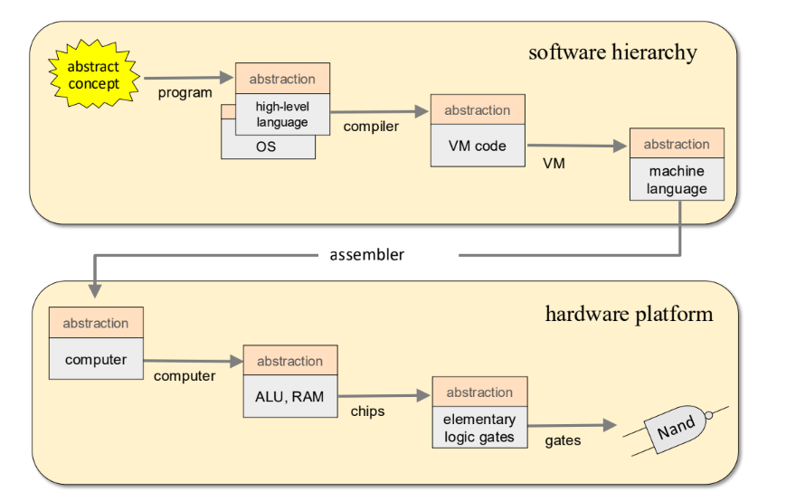

# Phần cứng

> Chuyến hành trình khám phá đích thực không nằm ở việc đi đến những miền đất mới, mà ở việc có được một đôi mắt mới.

—Marcel Proust (1871–1922)

Cuốn sách này là một hành trình khám phá. Bạn sắp học được ba điều: hệ thống máy tính vận hành như thế nào, cách chia nhỏ những bài toán phức tạp thành các mô-đun có thể quản lý được, và cách xây dựng các hệ thống phần cứng lẫn phần mềm quy mô lớn. Đây sẽ là một hành trình thực hành, khi bạn tự tay tạo ra một hệ thống máy tính hoàn chỉnh, hoạt động được, từ những nền móng thấp nhất. Những bài học bạn rút ra được, vốn còn quan trọng hơn bản thân chiếc máy tính, sẽ đến như những hệ quả phụ của quá trình kiến tạo ấy. Theo nhà tâm lý học Carl Rogers, “Kiểu học tập duy nhất có ảnh hưởng đáng kể đến hành vi là sự thật do chính mình khám phá ra hoặc tự mình chiếm lĩnh, tức chân lý đã được đồng hóa trong trải nghiệm.” Chương mở đầu này phác thảo một vài khám phá, chân lý và trải nghiệm đang chờ bạn phía trước.

Xin chào, thế giới phía dưới
Nếu bạn đã có chút kinh nghiệm lập trình, rất có thể bạn từng bắt gặp một chương trình giống như đoạn dưới đây từ khá sớm trong quá trình học. Còn nếu chưa từng, bạn vẫn có thể đoán chương trình này làm gì: nó hiển thị dòng chữ Hello World rồi kết thúc. Chương trình cụ thể này được viết bằng Jack, một ngôn ngữ bậc cao đơn giản, có phong cách giống Java:

```java
// Ví dụ đầu tiên trong Lập trình 101
class Main {
    function void main() {
        do Output.printString("Hello World");
        return;
    }
}
```

Những chương trình tầm thường như Hello World thực ra lại đơn giản một cách đánh lừa. Bạn đã bao giờ dừng lại để nghĩ xem cần những gì để một chương trình như vậy thực sự chạy được trên máy tính chưa? Hãy nhìn vào bên trong cỗ máy. Trước hết, lưu ý rằng chương trình này chẳng qua chỉ là một chuỗi ký tự thông thường, được lưu trong một tệp văn bản. Với máy tính, sự trừu tượng đó hoàn toàn bí hiểm, vì nó chỉ hiểu các chỉ thị được viết bằng ngôn ngữ máy. Vì vậy, nếu muốn thực thi chương trình này, việc đầu tiên ta phải làm là phân tích chuỗi ký tự cấu thành mã bậc cao, khám phá ngữ nghĩa của nó, tức xác định xem chương trình định làm gì, rồi sinh ra mã mức thấp diễn đạt lại chính ngữ nghĩa đó bằng ngôn ngữ máy của máy tính đích. Kết quả của quá trình chuyển dịch công phu ấy, được gọi là biên dịch, sẽ là một chuỗi lệnh ngôn ngữ máy có thể thực thi.

Dĩ nhiên, ngôn ngữ máy cũng là một sự trừu tượng, một tập hợp mã nhị phân được quy ước với nhau. Muốn biến sự trừu tượng ấy thành thứ cụ thể, ta phải hiện thực nó bằng một kiến trúc phần cứng nào đó. Và đến lượt mình, kiến trúc này lại được triển khai bằng một tập hợp chip nhất định: thanh ghi, đơn vị nhớ, bộ cộng, v.v. Thế nhưng mỗi thiết bị phần cứng ấy lại được dựng nên từ những cổng logic cơ bản ở tầng thấp hơn. Và các cổng này, đến lượt chúng, có thể được xây dựng từ những cổng nguyên thủy như Nand và Nor. Những cổng nguyên thủy này nằm rất thấp trong hệ phân cấp, nhưng ngay cả chúng cũng được tạo thành từ nhiều phần tử đóng cắt, thường được hiện thực bằng transistor. Còn mỗi transistor được làm từ... À, ta sẽ không đi xa hơn nữa, vì đó là chỗ khoa học máy tính kết thúc và vật lý bắt đầu.

Có lẽ bạn đang nghĩ: “Trên máy tính của tôi, biên dịch và chạy chương trình dễ hơn nhiều, tôi chỉ cần bấm vào biểu tượng này hoặc gõ lệnh kia là xong!” Đúng vậy, một hệ thống máy tính hiện đại giống như một tảng băng chìm: đa số mọi người chỉ nhìn thấy phần nổi, và hiểu biết của họ về hệ thống tính toán thường sơ sài, hời hợt. Nhưng nếu bạn muốn khám phá phần nằm dưới mặt nước, thì thật may cho bạn! Bên dưới đó là cả một thế giới hấp dẫn, được tạo nên từ những thứ đẹp đẽ nhất trong khoa học máy tính. Sự am hiểu tường tận về thế giới ngầm ấy là điều phân biệt những lập trình viên ngây thơ với những nhà phát triển thực thụ, những người có thể tạo ra các công nghệ phần cứng và phần mềm phức tạp. Và cách tốt nhất để hiểu cách các công nghệ này vận hành, hiểu theo đúng nghĩa thấm vào tận xương tủy, là tự tay xây dựng một hệ thống máy tính hoàn chỉnh từ nền móng thấp nhất.

## Từ Nand đến Tetris

Giả sử ta muốn xây dựng một hệ thống máy tính từ đầu, vậy ta nên xây máy tính nào? Hóa ra, mọi máy tính đa dụng, mọi PC, điện thoại thông minh hay máy chủ, đều là một cỗ máy “Nand đến Tetris”. Trước hết, ở tầng đáy, mọi máy tính đều dựa trên các cổng logic cơ bản, mà Nand là loại được dùng rộng rãi nhất trong công nghiệp (chúng tôi sẽ giải thích chính xác cổng Nand là gì ở chương 1). Thứ hai, mọi máy tính đa dụng đều có thể được lập trình để chạy trò chơi Tetris, cũng như bất kỳ chương trình nào khác mà bạn thích. Vì vậy, bản thân Nand hay Tetris đều không có gì đặc biệt. Điều biến cuốn sách này thành chuyến hành trình kỳ diệu mà bạn sắp bước vào chính là chữ đến trong cụm Từ Nand đến Tetris: đi trọn con đường từ một đống phần tử đóng cắt sơ khai đến một cỗ máy có thể lôi cuốn trí óc bằng văn bản, đồ họa, hoạt hình, âm nhạc, video, phân tích, mô phỏng, trí tuệ nhân tạo và mọi khả năng mà ta vốn kỳ vọng ở một máy tính đa dụng. Bởi vậy, ta sẽ xây nền tảng phần cứng cụ thể nào hay hệ phân cấp phần mềm nào thực ra không quá quan trọng, miễn là chúng dựa trên cùng những ý tưởng và kỹ thuật đặc trưng cho mọi hệ thống tính toán ngoài kia.

Hình I.1 mô tả các cột mốc chính trong lộ trình Nand đến Tetris. Bắt đầu từ tầng thấp nhất của hình, mọi máy tính đa dụng đều có một kiến trúc bao gồm ALU (Arithmetic Logic Unit, đơn vị số học và logic) và RAM (Random Access Memory, bộ nhớ truy cập ngẫu nhiên). Mọi thiết bị ALU và RAM đều được tạo nên từ các cổng logic cơ bản. Và thật đáng ngạc nhiên nhưng cũng may mắn thay, như ta sẽ sớm thấy, mọi cổng logic đều có thể được dựng chỉ từ các cổng Nand. Nhìn sang hệ phân cấp phần mềm, mọi ngôn ngữ bậc cao đều dựa vào một bộ công cụ chuyển dịch (trình biên dịch/trình thông dịch, máy ảo, trình hợp dịch) để hạ mã bậc cao xuống tận các chỉ lệnh mức máy. Một số ngôn ngữ bậc cao được thông dịch thay vì biên dịch, và một số không dùng máy ảo, nhưng bức tranh tổng thể về cơ bản vẫn như nhau. Quan sát này là một biểu hiện của một nguyên lý nền tảng trong khoa học máy tính, được gọi là giả thuyết Church-Turing: ở tầng đáy, mọi máy tính về bản chất đều tương đương nhau.



Hình I.1     Các mô-đun chính của một hệ thống máy tính điển hình, bao gồm một nền tảng phần cứng và một hệ phân cấp phần mềm. Mỗi mô-đun có một góc nhìn trừu tượng (còn gọi là giao diện của mô-đun) và một phần hiện thực. Các mũi tên hướng sang phải biểu thị rằng mỗi mô-đun được hiện thực bằng những khối xây dựng trừu tượng ở tầng bên dưới. Mỗi vòng tròn đại diện cho một dự án và một chương trong Nand to Tetris, tổng cộng là mười hai dự án và mười hai chương

Chúng tôi nêu ra những nhận xét này để nhấn mạnh tính khái quát của cách tiếp cận: những thách thức, trực giác, mẹo, thủ thuật, kỹ thuật và thuật ngữ mà bạn gặp trong cuốn sách này cũng chính là những gì các kỹ sư phần cứng và phần mềm chuyên nghiệp đối mặt trong thực tế. Theo nghĩa đó, Nand to Tetris là một nghi thức nhập môn: nếu bạn đi trọn được hành trình này, bạn sẽ có một nền tảng rất tốt để tự mình trở thành một chuyên gia máy tính thực thụ.

Vậy trong Nand to Tetris, ta sẽ xây nền tảng phần cứng cụ thể nào và ngôn ngữ bậc cao cụ thể nào? Một khả năng là xây một mô hình máy tính phổ biến, đủ sức dùng trong công nghiệp, và viết trình biên dịch cho một ngôn ngữ bậc cao thịnh hành. Chúng tôi đã không chọn hướng đó, vì ba lý do. Thứ nhất, các mô hình máy tính đến rồi đi, và các ngôn ngữ lập trình đang thịnh hành cũng sẽ nhường chỗ cho những ngôn ngữ mới. Vì vậy, chúng tôi không muốn gắn mình với bất kỳ cấu hình phần cứng/phần mềm cụ thể nào. Thứ hai, các máy tính và ngôn ngữ dùng trong thực tế có vô số chi tiết ít giá trị sư phạm nhưng lại tốn rất nhiều thời gian để hiện thực. Cuối cùng, chúng tôi muốn có một nền tảng phần cứng và một hệ phân cấp phần mềm dễ kiểm soát, dễ hiểu và dễ mở rộng. Những cân nhắc này đã dẫn đến sự ra đời của Hack, nền tảng máy tính được xây trong phần I của sách, và Jack, ngôn ngữ bậc cao được hiện thực trong phần II.

Thông thường, người ta mô tả các hệ thống máy tính theo hướng từ trên xuống, cho thấy các tầng trừu tượng bậc cao có thể được rút gọn về, hay được hiện thực bởi, các tầng đơn giản hơn như thế nào. Chẳng hạn, ta có thể mô tả cách các chỉ lệnh máy nhị phân chạy trên kiến trúc máy tính được phân rã thành các vi mã đi qua dây dẫn trong kiến trúc rồi cuối cùng thao tác lên các chip ALU và RAM ở tầng thấp hơn. Ngược lại, ta cũng có thể đi từ dưới lên, mô tả cách các chip ALU và RAM được thiết kế khéo léo để thực thi các vi mã, mà khi ghép lại sẽ tạo thành các chỉ lệnh máy nhị phân. Cả cách tiếp cận từ trên xuống lẫn từ dưới lên đều rất khai sáng, mỗi cách đem lại một góc nhìn khác nhau về hệ thống mà ta sắp xây dựng.

Trong hình I.1, hướng của các mũi tên gợi ra một định hướng từ trên xuống. Với bất kỳ cặp mô-đun nào, đều có một mũi tên hướng sang phải nối mô-đun ở tầng cao hơn với mô-đun ở tầng thấp hơn. Ý nghĩa của mũi tên này rất cụ thể: nó hàm ý rằng mô-đun ở tầng cao hơn được hiện thực bằng những khối xây dựng trừu tượng ở tầng bên dưới. Ví dụ, một chương trình bậc cao được hiện thực bằng cách dịch từng câu lệnh bậc cao thành một tập lệnh VM trừu tượng. Và đến lượt mình, mỗi lệnh VM lại tiếp tục được dịch xuống thành một tập chỉ lệnh ngôn ngữ máy trừu tượng. Cứ thế tiếp diễn. Sự phân biệt giữa trừu tượng và hiện thực giữ vai trò rất lớn trong thiết kế hệ thống, và giờ ta sẽ bàn đến điều đó.

## Trừu tượng và hiện thực

Bạn có thể tự hỏi làm sao con người lại có thể xây được một hệ thống máy tính hoàn chỉnh từ nền móng thấp nhất, khởi đầu chỉ với những cổng logic cơ bản. Hẳn đó phải là một công trình khổng lồ! Ta xử lý độ phức tạp này bằng cách chia hệ thống thành các mô-đun. Mỗi mô-đun được mô tả riêng trong một chương dành riêng cho nó, và được xây dựng riêng trong một dự án độc lập. Bạn có thể lại thắc mắc: làm sao có thể mô tả và xây các mô-đun ấy trong sự tách biệt? Chắc chắn chúng có liên hệ với nhau! Như chúng tôi sẽ chứng minh xuyên suốt cuốn sách, một thiết kế mô-đun tốt chính là như vậy: bạn có thể làm việc trên từng mô-đun riêng lẻ một cách độc lập, hoàn toàn bỏ qua phần còn lại của hệ thống. Thực tế, nếu hệ thống được thiết kế tốt, bạn có thể xây các mô-đun theo bất kỳ thứ tự nào, thậm chí làm song song nếu làm việc theo nhóm.

Năng lực nhận thức giúp ta “chia để trị” một hệ thống phức tạp thành những mô-đun có thể quản lý được còn được nâng đỡ bởi một món quà nhận thức khác: khả năng phân biệt giữa trừu tượng và hiện thực của từng mô-đun. Trong khoa học máy tính, ta dùng hai từ này theo nghĩa rất cụ thể: trừu tượng mô tả mô-đun làm gì, còn hiện thực mô tả nó làm điều đó như thế nào. Ghi nhớ sự phân biệt này, đây là quy tắc quan trọng nhất trong kỹ nghệ hệ thống: khi dùng một mô-đun như một khối xây dựng, bất kỳ mô-đun nào, bạn chỉ được tập trung vào phần trừu tượng của mô-đun, và hoàn toàn bỏ qua chi tiết hiện thực của nó.

Ví dụ, hãy nhìn vào tầng đáy của hình I.1, bắt đầu từ mức “kiến trúc máy tính”. Như thấy trong hình, việc hiện thực kiến trúc này sử dụng nhiều khối xây dựng từ tầng bên dưới, trong đó có một bộ nhớ truy cập ngẫu nhiên. RAM là một thiết bị đáng kinh ngạc. Nó có thể chứa hàng tỷ thanh ghi, nhưng bất kỳ thanh ghi nào trong số đó cũng có thể được truy cập trực tiếp, gần như tức thời. Hình I.1 cho ta biết rằng kiến trúc sư máy tính nên sử dụng thiết bị truy cập trực tiếp này một cách trừu tượng, không cần bận tâm gì đến việc nó thực sự được hiện thực ra sao. Tất cả công sức, sự khéo léo và cả kịch tính đã đổ vào việc hiện thực phép màu RAM truy cập trực tiếp ấy, tức phần làm như thế nào, đều phải được gạt sang một bên, vì thông tin đó không liên quan trong ngữ cảnh dùng RAM để tạo ra hiệu quả của nó.

Đi xuống thêm một tầng trong hình I.1, giờ đây ta ở vào vị trí phải xây chính con chip RAM. Ta nên bắt đầu thế nào? Đi theo mũi tên hướng sang phải, ta thấy phần hiện thực RAM sẽ dựa trên các cổng logic cơ bản và các chip ở tầng bên dưới. Cụ thể, khả năng lưu trữ và truy cập trực tiếp của RAM sẽ lần lượt được hiện thực bằng các thanh ghi và các bộ hợp kênh. Và một lần nữa, nguyên lý trừu tượng-hiện thực lại phát huy tác dụng: ta sẽ dùng những chip này như các khối xây dựng trừu tượng, tập trung vào giao diện của chúng, và hoàn toàn không bận tâm đến phần hiện thực. Cứ thế, cho đến tận tầng Nand.

Tóm lại, mỗi khi phần hiện thực của bạn sử dụng một mô-đun phần cứng hoặc phần mềm ở tầng thấp hơn, bạn phải coi mô-đun đó như một sự trừu tượng có sẵn, một hộp đen mua ngoài: tất cả những gì bạn cần là tài liệu giao diện của mô-đun, mô tả nó làm được gì, và thế là đủ để bắt tay vào việc. Bạn tuyệt đối không được bận tâm đến cách mô-đun thực hiện những gì giao diện của nó cam kết. Mô hình trừu tượng-hiện thực này giúp nhà phát triển quản lý độ phức tạp và giữ được sự tỉnh táo: bằng cách chia một hệ thống tưởng như áp đảo thành những mô-đun được xác định rõ ràng, ta tạo ra những phần việc hiện thực có thể kiểm soát và khoanh vùng được việc phát hiện cũng như sửa lỗi. Đây là nguyên lý thiết kế quan trọng nhất trong các dự án xây dựng phần cứng và phần mềm.

Không cần phải nói, toàn bộ câu chuyện này phụ thuộc vào nghệ thuật thiết kế mô-đun tinh vi: khả năng của con người trong việc tách bài toán trước mắt thành một tập hợp thanh nhã các mô-đun được xác định rõ, mỗi mô-đun có một giao diện rõ ràng, mỗi mô-đun đại diện cho một phần việc hiện thực độc lập với độ lớn hợp lý, mỗi mô-đun đều có thể gắn với một chương trình kiểm thử đơn vị riêng. Thật vậy, thiết kế mô-đun là cơm ăn nước uống của khoa học máy tính ứng dụng: mọi kiến trúc sư hệ thống đều thường xuyên định nghĩa các sự trừu tượng, đôi khi được gọi là mô-đun hoặc giao diện, rồi tự mình hiện thực chúng hoặc giao cho người khác hiện thực. Các tầng trừu tượng này thường được chồng lớp lên nhau, tạo nên những mức chức năng ngày càng cao. Nếu kiến trúc sư hệ thống thiết kế được một bộ mô-đun tốt, công việc hiện thực sẽ trôi chảy như nước trong; nếu thiết kế cẩu thả, phần hiện thực sẽ ngay từ đầu đã bị định sẵn thất bại.

Thiết kế mô-đun là một nghệ thuật phải học mới có, được mài giũa bằng cách quan sát và hiện thực nhiều sự trừu tượng được thiết kế tốt. Đó chính xác là điều bạn sắp trải nghiệm trong Nand to Tetris: bạn sẽ học cách cảm nhận vẻ thanh lịch và công năng của hàng trăm sự trừu tượng phần cứng và phần mềm. Sau đó, bạn sẽ được hướng dẫn cách hiện thực từng sự trừu tượng ấy, từng bước một, tạo ra những khối chức năng ngày càng lớn hơn. Khi tiếp tục đẩy cuộc hành trình này tiến lên, đi từ chương này sang chương khác, sẽ thật phấn khích nếu ngoái lại và nhận ra hệ thống máy tính đang dần thành hình nhờ chính công sức của bạn.

## Phương pháp luận

Hành trình Nand to Tetris bao gồm việc xây một nền tảng phần cứng và một hệ phân cấp phần mềm. Nền tảng phần cứng được xây từ khoảng ba mươi cổng logic và chip, được thực hiện trong phần I của sách. Mỗi cổng và chip trong số đó, kể cả kiến trúc máy tính ở tầng cao nhất, sẽ được xây bằng một ngôn ngữ mô tả phần cứng. HDL mà chúng ta dùng được mô tả trong phụ lục 2 và có thể học trong khoảng một giờ. Bạn sẽ kiểm tra tính đúng đắn của các chương trình HDL bằng một trình mô phỏng phần cứng chạy bằng phần mềm trên PC của mình. Đây chính xác là cách các kỹ sư phần cứng làm việc trong thực tế: họ xây và kiểm thử chip bằng các trình mô phỏng phần mềm. Khi đã hài lòng với hiệu năng mô phỏng của chip, họ gửi đặc tả của mình, tức các chương trình HDL, cho một công ty chế tạo. Sau quá trình tối ưu hóa, các chương trình HDL trở thành đầu vào cho những cánh tay robot xây dựng phần cứng trên silicon.

Tiến lên cao hơn trong hành trình Nand to Tetris, ở phần II của sách chúng ta sẽ xây một ngăn xếp phần mềm bao gồm trình hợp dịch, máy ảo và trình biên dịch. Các chương trình này có thể được hiện thực bằng bất kỳ ngôn ngữ lập trình bậc cao nào. Ngoài ra, chúng ta còn sẽ xây một hệ điều hành cơ bản, được viết bằng Jack.

Bạn có thể tự hỏi làm sao có thể phát triển những dự án đầy tham vọng như vậy trong phạm vi của một khóa học hay một cuốn sách. Ngoài thiết kế mô-đun, bí quyết cốt lõi của chúng tôi là giảm bất định trong thiết kế xuống mức thấp nhất có thể. Chúng tôi sẽ cung cấp giàn giáo rất chi tiết cho từng dự án, bao gồm API đầy đủ, các chương trình khung, kịch bản kiểm thử và hướng dẫn hiện thực theo từng giai đoạn.

Toàn bộ các công cụ phần mềm cần thiết để hoàn thành các dự án 1–12 đều có trong bộ phần mềm Nand to Tetris, có thể tải miễn phí từ www.nand2tetris.org. Chúng bao gồm một trình mô phỏng phần cứng, một bộ giả lập CPU, một bộ giả lập VM, và các phiên bản thực thi sẵn của các chip phần cứng, trình hợp dịch, trình biên dịch và hệ điều hành. Một khi bạn tải bộ phần mềm này về PC, tất cả các công cụ đó sẽ nằm trong tầm tay bạn.

## Chặng đường phía trước

Hành trình Nand to Tetris bao gồm mười hai dự án xây dựng phần cứng và phần mềm. Hướng phát triển tổng quát xuyên suốt các dự án này, cũng như mục lục của sách, cho thấy một hành trình từ dưới lên: ta bắt đầu với các cổng logic cơ bản và đi dần lên, để rồi đi tới một ngôn ngữ lập trình bậc cao hướng đối tượng. Đồng thời, hướng phát triển bên trong mỗi dự án lại là từ trên xuống. Cụ thể, mỗi khi trình bày một mô-đun phần cứng hay phần mềm, chúng ta luôn bắt đầu bằng mô tả trừu tượng về việc mô-đun đó được thiết kế để làm gì và vì sao nó cần thiết. Một khi bạn hiểu được phần trừu tượng của mô-đun, bản thân nó đã là cả một thế giới phong phú, bạn sẽ bắt tay vào hiện thực nó bằng những khối xây dựng trừu tượng từ tầng bên dưới.

Vậy nên, cuối cùng, đây là đại kế hoạch cho phần I trong chuyến công phá đầy nội lực của chúng ta. Ở chương 1, ta bắt đầu với một cổng logic duy nhất, Nand, và từ đó xây nên một tập các cổng logic cơ bản và được dùng phổ biến như And, Or, Xor, v.v. Ở chương 2 và 3, ta dùng các khối xây dựng này để lần lượt tạo ra một đơn vị số học và logic cùng các thiết bị nhớ. Ở chương 4, ta tạm dừng hành trình xây phần cứng để giới thiệu một ngôn ngữ máy mức thấp ở cả dạng ký hiệu lẫn dạng nhị phân. Ở chương 5, ta dùng ALU và các đơn vị nhớ đã xây trước đó để tạo ra một bộ xử lý trung tâm (CPU) và một bộ nhớ truy cập ngẫu nhiên (RAM). Những thiết bị này sau đó sẽ được tích hợp thành một nền tảng phần cứng có khả năng chạy các chương trình viết bằng ngôn ngữ máy được trình bày ở chương 4. Ở chương 6, ta mô tả và xây một trình hợp dịch, tức chương trình dịch các chương trình mức thấp viết bằng ngôn ngữ máy ký hiệu sang mã nhị phân có thể thực thi. Như vậy, việc xây nền tảng phần cứng sẽ hoàn tất. Nền tảng này rồi sẽ trở thành điểm xuất phát cho phần II của cuốn sách, nơi ta mở rộng phần cứng sơ khai bằng một hệ phân cấp phần mềm hiện đại gồm máy ảo, trình biên dịch và hệ điều hành.

Chúng tôi hy vọng mình đã truyền đạt được phần nào những gì đang chờ phía trước, và rằng bạn đang nóng lòng muốn bắt đầu chuyến hải trình khám phá vĩ đại này. Vậy nên, nếu bạn đã sẵn sàng, thì hãy để màn đếm ngược bắt đầu: 1, 0, Go!