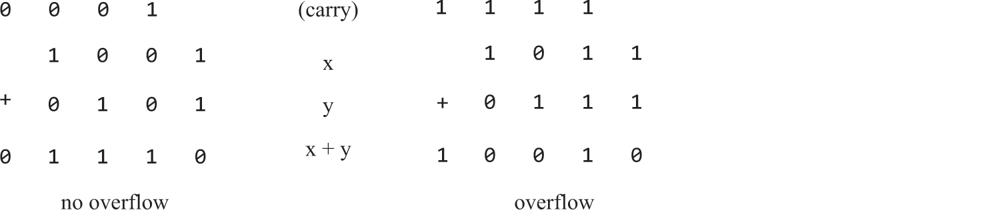
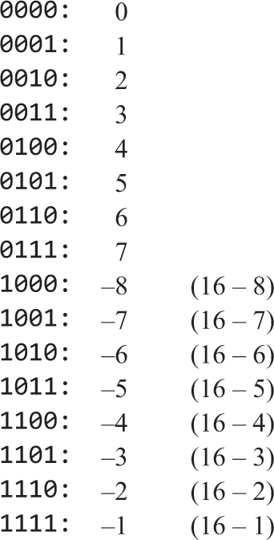
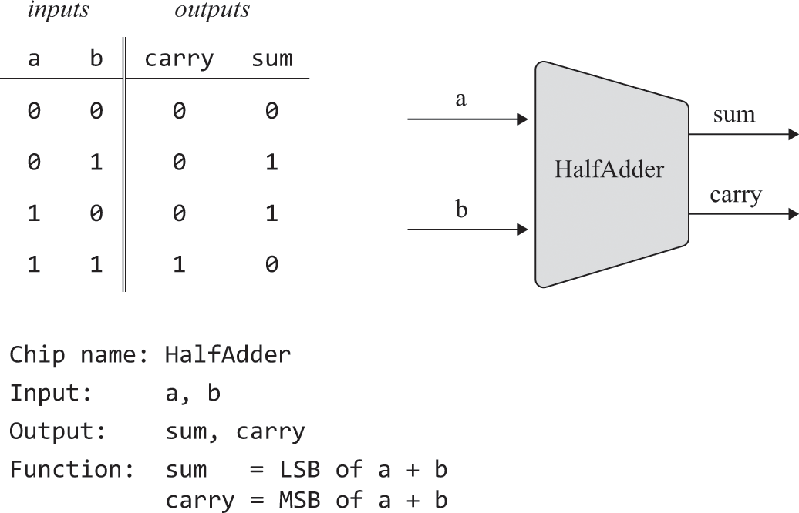
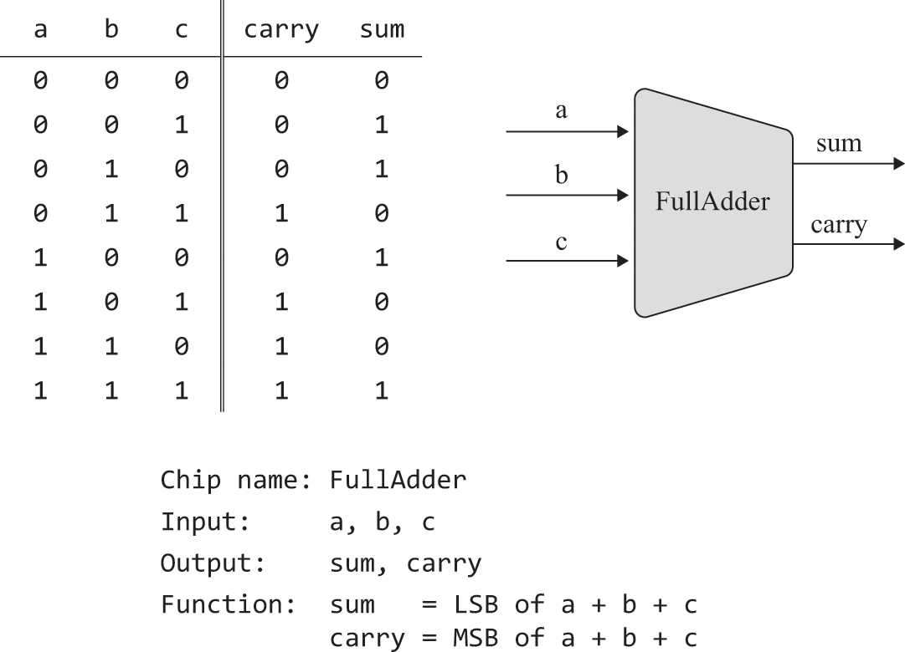
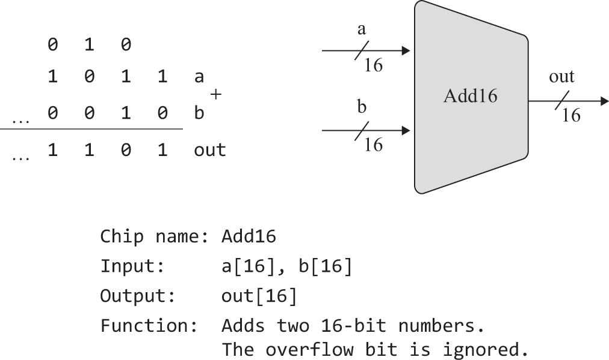
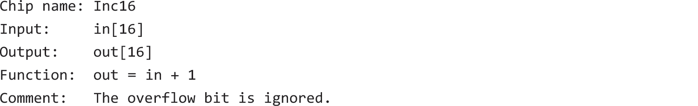
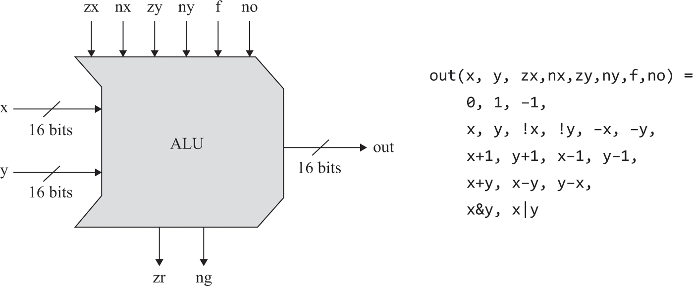
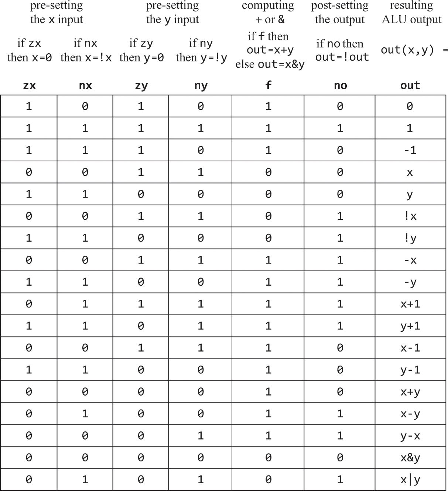
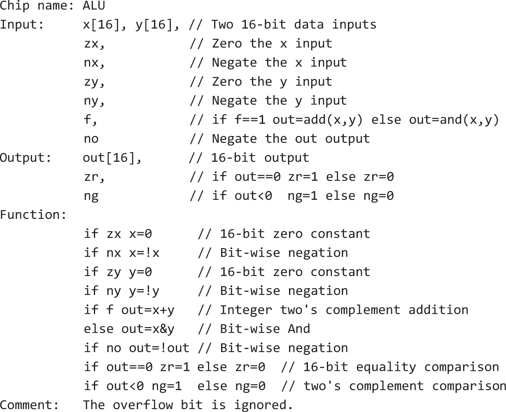

# 2 Số học Boolean

> Đếm là tôn giáo của thế hệ này, là niềm hy vọng và sự cứu rỗi của nó.

—Gertrude Stein (1874–1946)

Trong chương này, chúng ta xây dựng một họ chip được thiết kế để biểu diễn số và thực hiện các phép toán số học. Điểm xuất phát của chúng ta là tập các cổng Logic được xây dựng ở chương 1, và điểm kết thúc là một Arithmetic Logic Unit hoàn chỉnh. Về sau, ALU sẽ trở thành trung tâm tính toán của Central Processing Unit (CPU), tức con chip thực thi mọi lệnh mà máy tính xử lý. Vì thế, xây dựng ALU là một cột mốc quan trọng trên hành trình Nand to Tetris của chúng ta.

Như thường lệ, chúng ta tiếp cận nhiệm vụ này một cách tuần tự. Trước hết là phần nền tảng, mô tả cách mã nhị phân và số học Boolean có thể lần lượt được dùng để biểu diễn và cộng các số nguyên có dấu. Phần Specification trình bày một chuỗi chip cộng được thiết kế để cộng hai bit, ba bit và các cặp số nhị phân n-bit. Từ đó, ta có đủ nền tảng để đi tới đặc tả ALU, vốn dựa trên một thiết kế Logic đơn giản đến bất ngờ. Phần Implementation và Project cung cấp các mẹo và hướng dẫn về cách xây dựng các chip cộng và ALU bằng HDL cùng bộ mô phỏng phần cứng được cung cấp.

## 2.1 Các phép toán số học

Các hệ thống máy tính đa dụng phải thực hiện được ít nhất các phép toán số học sau đây trên số nguyên có dấu:

- phép cộng
- đổi dấu
- phép trừ
- so sánh
- phép nhân
- phép chia

Chúng ta sẽ bắt đầu bằng cách phát triển Logic cổng để thực hiện phép cộng và phép đổi dấu. Về sau, chúng ta sẽ chỉ ra cách các phép toán số học còn lại có thể được hiện thực từ hai khối xây dựng này.

Trong toán học cũng như khoa học máy tính, phép cộng là một phép toán đơn giản nhưng có chiều sâu nền tảng. Điều đáng chú ý là mọi chức năng do máy tính số thực hiện, không chỉ riêng các phép toán số học, đều có thể được quy về việc cộng các số nhị phân. Vì vậy, hiểu một cách xây dựng về phép cộng nhị phân là chìa khóa để hiểu nhiều phép toán nền tảng mà phần cứng máy tính thực hiện.

## 2.2 Số nhị phân

Khi được nói rằng một mã nào đó, chẳng hạn 6083, biểu diễn một số trong hệ thập phân, thì theo quy ước ta hiểu số này là:

$
(6083)_{10} = 6 \cdot 10^3 + 0 \cdot 10^2 + 8 \cdot 10^1 + 3 \cdot 10^0 = 6083
$

Mỗi chữ số trong mã thập phân đóng góp một giá trị phụ thuộc vào cơ số 10 và vị trí của chữ số đó trong mã. Giờ hãy giả sử ta được nói rằng mã 10011 biểu diễn một số trong cơ số 2, hay biểu diễn nhị phân. Để tính giá trị của số này, ta làm đúng cùng một quy trình như trên, chỉ thay cơ số 10 bằng cơ số 2:

$(10011)_2 = 1 \cdot 2^4 + 0 \cdot 2^3 + 0 \cdot 2^2 + 1 \cdot 2^1 + 1 \cdot 2^0 = 19$

Bên trong máy tính, mọi thứ đều được biểu diễn bằng mã nhị phân. Ví dụ, khi ta nhấn các phím 1, 9 và Enter để trả lời cho câu hỏi “Hãy cho một ví dụ về số nguyên tố,” thì thứ thực sự được lưu trong bộ nhớ máy tính là mã nhị phân 10011. Khi ta yêu cầu máy tính hiển thị giá trị này lên màn hình, quá trình sau sẽ diễn ra. Đầu tiên, hệ điều hành của máy tính tính ra giá trị thập phân mà 10011 biểu diễn, và giá trị đó là 19. Sau khi chuyển giá trị nguyên này thành hai ký tự 1 và 9, hệ điều hành tra cứu phông chữ hiện hành và lấy ra hai ảnh bitmap dùng để dựng các ký tự này lên màn hình. Sau đó, hệ điều hành khiến trình điều khiển màn hình bật và tắt các điểm ảnh liên quan, và, xin đừng nín thở quá lâu, vì toàn bộ việc này chỉ kéo dài một phần rất nhỏ của một giây, cuối cùng ta thấy hình ảnh 19 xuất hiện trên màn hình.

Ở chương 12, chúng ta sẽ xây dựng một hệ điều hành thực hiện các thao tác dựng hình như vậy, cùng nhiều dịch vụ mức thấp khác. Còn lúc này, chỉ cần ghi nhận rằng biểu diễn thập phân của các con số là một sự nuông chiều của loài người, được giải thích bởi sự thật hơi mù mờ rằng vào một thời điểm nào đó trong lịch sử cổ đại, con người quyết định biểu diễn số lượng bằng mười ngón tay của mình, rồi thói quen ấy cứ thế tồn tại. Từ góc độ toán học, số mười hoàn toàn chẳng có gì thú vị, còn với máy tính thì nó là một sự phiền toái đúng nghĩa. Máy tính xử lý mọi thứ ở dạng nhị phân và chẳng bận tâm gì tới hệ thập phân. Tuy nhiên, vì con người cứ khăng khăng làm việc với các con số bằng mã thập phân, máy tính buộc phải âm thầm làm việc cật lực để chuyển đổi qua lại giữa nhị phân và thập phân mỗi khi con người muốn xem, hoặc cung cấp, thông tin số. Còn vào mọi thời điểm khác, máy tính cứ trung thành với nhị phân.

Kích thước từ cố định: Các số nguyên dĩ nhiên là không bị chặn trên dưới: với bất kỳ số x nào cho trước, luôn có những số nguyên nhỏ hơn x và những số nguyên lớn hơn x. Tuy nhiên, máy tính là các cỗ máy hữu hạn và dùng một kích thước từ cố định để biểu diễn số. Word size là một thuật ngữ phần cứng thông dụng dùng để chỉ số lượng bit mà máy tính dùng để biểu diễn một đơn vị thông tin cơ bản, trong trường hợp này là các giá trị nguyên. Thông thường, các thanh ghi 8, 16, 32 hoặc 64 bit được dùng để biểu diễn số nguyên.^1 Kích thước từ cố định hàm ý rằng số lượng giá trị mà các thanh ghi này có thể biểu diễn là có giới hạn.

Ví dụ, giả sử ta dùng các thanh ghi 8 bit để biểu diễn số nguyên. Cách biểu diễn này có thể mã hóa $2^8$ giá trị khác nhau. Nếu ta chỉ muốn biểu diễn các số nguyên không âm, ta có thể gán 00000000 để biểu diễn 0, 00000001 để biểu diễn 1, 00000010 để biểu diễn 2, 00000011 để biểu diễn 3, và cứ thế cho tới 11111111 để biểu diễn 255. Nói chung, dùng n bit, ta có thể biểu diễn mọi số nguyên không âm trong khoảng từ 0 đến $2^n - 1$.

Vậy còn biểu diễn các số âm bằng mã nhị phân thì sao? Về sau trong chương, chúng ta sẽ trình bày một kỹ thuật xử lý thách thức này theo cách hết sức thanh nhã và thỏa đáng.

Và còn các số lớn hơn, hoặc nhỏ hơn, giá trị cực đại và cực tiểu mà kích thước thanh ghi cố định cho phép thì sao? Mọi ngôn ngữ bậc cao đều cung cấp các trừu tượng để xử lý những con số lớn hoặc nhỏ tới mức gần như ta mong muốn trong thực tế. Các trừu tượng này thường được hiện thực bằng cách ghép nối nhiều thanh ghi n-bit tùy theo nhu cầu biểu diễn số. Vì việc thực thi các phép toán số học và Logic trên các số nhiều từ là khá chậm, người ta khuyến nghị chỉ dùng cách này khi ứng dụng thực sự cần xử lý các con số cực lớn hoặc cực nhỏ.

## 2.3 Phép cộng nhị phân

Một cặp số nhị phân có thể được cộng theo từng bit từ phải sang trái, bằng đúng thuật toán cộng thập phân mà ta học ở bậc tiểu học. Trước hết, ta cộng hai bit ngoài cùng bên phải, còn được gọi là các bit có trọng số thấp nhất (LSB) của hai số nhị phân. Tiếp theo, ta cộng bit nhớ thu được vào tổng của cặp bit kế tiếp. Ta tiếp tục quá trình đồng bộ này cho tới khi cộng xong hai bit có trọng số cao nhất (MSB) ở phía bên trái. Dưới đây là một ví dụ về thuật toán này đang hoạt động, với giả định rằng ta dùng kích thước từ cố định là 4 bit:

Nếu phép cộng ở bit có trọng số cao nhất sinh ra bit nhớ bằng 1, ta có hiện tượng gọi là tràn số. Xử lý tràn số như thế nào là một lựa chọn thiết kế, và lựa chọn của chúng ta là bỏ qua nó. Về cơ bản, điều mà ta hài lòng bảo đảm là kết quả của phép cộng hai số n-bit bất kỳ sẽ đúng trong phạm vi n bit. Nhân tiện, ta cũng lưu ý rằng việc bỏ qua một thứ gì đó là hoàn toàn chấp nhận được, miễn là ta nói rõ và minh bạch về điều đó.

## 2.4 Số nhị phân có dấu

Một hệ nhị phân n-bit có thể mã hóa $2^n$ giá trị khác nhau. Nếu phải biểu diễn các số có dấu, tức số dương và số âm, bằng mã nhị phân, thì một cách làm tự nhiên là chia không gian mã hiện có thành hai tập con: một tập để biểu diễn các số không âm, và tập còn lại để biểu diễn các số âm. Lý tưởng nhất, sơ đồ mã hóa nên được chọn sao cho việc đưa số có dấu vào sẽ làm cho hiện thực phần cứng của các phép toán số học phức tạp thêm ít nhất có thể.

Qua nhiều năm, thách thức này đã dẫn tới sự ra đời của một số sơ đồ mã hóa để biểu diễn số có dấu bằng mã nhị phân. Giải pháp ngày nay được dùng trong gần như mọi máy tính được gọi là phương pháp two’s complement, còn được biết tới với tên radix complement. Trong một hệ nhị phân dùng kích thước từ n bit, mã nhị phân two’s complement biểu diễn số âm x được lấy là mã biểu diễn giá trị $2^n - x$. Ví dụ, trong một hệ nhị phân 4 bit, $-7$ được biểu diễn bằng mã nhị phân gắn với giá trị $2^4 - 7 = 9$, và mã đó là 1001. Nhớ rằng $7$ được biểu diễn bởi 0111, ta thấy rằng 1001 đúng là mã đối bù của 0111 theo two’s complement, nếu bỏ qua bit tràn. Hình 2.1 liệt kê toàn bộ các số có dấu được biểu diễn bởi một hệ 4 bit dùng phương pháp two’s complement.

Quan sát hình 2.1 cho thấy một hệ nhị phân n-bit với biểu diễn two’s complement có các tính chất hấp dẫn sau:

- Hệ mã hóa $2^n$ số có dấu, trong khoảng từ $-2^{n-1}$ đến $2^{n-1} - 1$
- Mã của mọi số không âm đều bắt đầu bằng bit 0.
- Mã của mọi số âm đều bắt đầu bằng bit 1.
- Để thu được mã nhị phân của $-x$ từ mã nhị phân của x, hãy giữ nguyên tất cả các bit 0 ở cuối phía phải cùng bit 1 đầu tiên tính từ phải sang, rồi đảo mọi bit còn lại, tức đổi 0 thành 1 và ngược lại. Cách khác là đảo toàn bộ các bit của x rồi cộng thêm 1 vào kết quả.

Một đặc điểm đặc biệt hấp dẫn của biểu diễn two’s complement là phép trừ được xử lý như một trường hợp đặc biệt của phép cộng. Để minh họa, hãy xét phép toán $4 - 6$. Lưu ý rằng điều này tương đương với $4 + (-6)$ và dựa theo hình 2.1, ta tiến hành tính $0100 + 1010$. Kết quả là 1110, đúng là mã nhị phân của $-2$. Đây là một ví dụ khác: để tính $-3 - 2$, ta cộng 1101 và 1110, thu được tổng 11011. Bỏ qua bit tràn, ta còn 1011, và đó chính là mã nhị phân của $-5$.

Ta thấy rằng phương pháp two’s complement cho phép cộng và trừ các số có dấu mà không cần gì hơn ngoài phần cứng vốn đã cần để cộng các số không âm. Như ta sẽ thấy về sau trong sách, mọi phép toán số học, từ nhân, chia cho tới căn bậc hai, đều có thể được hiện thực theo lối quy giản bằng phép cộng nhị phân. Vì thế, một mặt ta thấy rằng một phạm vi rất rộng các năng lực của máy tính dựa trên phép cộng nhị phân, còn mặt khác ta thấy rằng phương pháp two’s complement loại bỏ nhu cầu phải có phần cứng đặc biệt cho việc cộng và trừ số có dấu. Gộp hai nhận xét này lại, ta buộc phải kết luận rằng phương pháp two’s complement là một trong những anh hùng thầm lặng đáng kinh ngạc nhất của khoa học máy tính ứng dụng.

## 2.5 Specification

Giờ đây, chúng ta chuyển sang đặc tả một hệ thứ bậc các chip, bắt đầu từ những bộ cộng đơn giản và kết thúc ở một Arithmetic Logic Unit (ALU). Như thường lệ trong cuốn sách này, trước hết ta tập trung vào mặt trừu tượng, tức các chip được thiết kế để làm gì, còn các chi tiết hiện thực, tức chúng làm điều đó như thế nào, sẽ được để sang phần tiếp theo. Chúng ta khó mà cưỡng lại việc nhắc lại, với một chút thích thú, rằng nhờ phương pháp two’s complement, ta chẳng cần nói gì đặc biệt về việc xử lý số có dấu. Mọi chip số học mà chúng ta sắp trình bày đều hoạt động tốt như nhau với số không âm, số âm và cả các cặp số khác dấu.

### 2.5.1 Adders

Chúng ta sẽ tập trung vào hệ thứ bậc các bộ cộng sau:

- Half-adder: được thiết kế để cộng hai bit
- Full-adder: được thiết kế để cộng ba bit
- Adder: được thiết kế để cộng hai số n-bit

Ta cũng sẽ đặc tả một bộ cộng chuyên dụng, gọi là incrementer, được thiết kế để cộng 1 vào một số cho trước. (Tên gọi half-adder và full-adder xuất phát từ chi tiết hiện thực rằng một chip full-adder có thể được tạo từ hai half-adder, như ta sẽ thấy về sau trong chương.)

Half-adder: Bước đầu tiên trên con đường cộng các số nhị phân là cộng hai bit. Hãy xem kết quả của phép toán này như một số 2 bit, và lần lượt gọi bit bên phải và bit bên trái của nó là sum và carry. Hình 2.2 trình bày một chip thực hiện phép cộng này.

Hình 2.2    Half-adder, được thiết kế để cộng 2 bit.

Full-adder: Hình 2.3 trình bày một chip full-adder, được thiết kế để cộng ba bit. Giống như half-adder, chip full-adder xuất ra hai bit mà khi lấy cùng nhau sẽ biểu diễn kết quả cộng của ba bit đầu vào.

Adder: Máy tính biểu diễn số nguyên bằng một kích thước từ cố định như 8, 16, 32 hoặc 64 bit. Chip có nhiệm vụ cộng hai số n-bit như vậy được gọi là adder. Hình 2.4 trình bày một adder 16 bit.

Hình 2.4    Adder 16 bit, được thiết kế để cộng hai số 16 bit, kèm một ví dụ về phép cộng ở phía bên trái.

Nhân tiện, ta lưu ý rằng thiết kế Logic để cộng các số 16 bit có thể được mở rộng rất dễ dàng để hiện thực một chip adder n-bit bất kỳ, bất kể giá trị n là bao nhiêu.

Incrementer: Khi về sau thiết kế kiến trúc máy tính của mình, chúng ta sẽ cần một chip cộng 1 vào một số cho trước. Xin bật mí trước: việc này sẽ cho phép nạp lệnh kế tiếp từ bộ nhớ sau khi thực thi xong lệnh hiện tại. Mặc dù phép toán cộng thêm 1 có thể được hiện thực bởi chip Adder đa dụng của chúng ta, một chip incrementer chuyên biệt có thể làm điều đó hiệu quả hơn. Dưới đây là giao diện chip:

### 2.5.2 Arithmetic Logic Unit

Mọi chip cộng đã trình bày cho tới đây đều mang tính tổng quát: bất kỳ máy tính nào thực hiện phép toán số học cũng sẽ dùng những chip như vậy, theo cách này hay cách khác. Dựa trên các chip ấy, giờ đây chúng ta chuyển sang mô tả một Arithmetic Logic Unit, con chip mà về sau sẽ trở thành trung tâm tính toán của CPU. Không giống các cổng và chip tổng quát đã bàn cho tới đây, thiết kế ALU là riêng cho chiếc máy tính được xây dựng trong Nand to Tetris, có tên là Hack. Tuy vậy, các nguyên lý thiết kế đứng sau Hack ALU vẫn mang tính tổng quát và giàu giá trị minh họa. Hơn nữa, kiến trúc ALU của chúng ta đạt được rất nhiều chức năng chỉ với một tập thành phần nội bộ tối thiểu. Xét ở phương diện đó, nó là một ví dụ đẹp về thiết kế Logic vừa hiệu quả vừa thanh nhã.

Đúng như tên gọi, một Arithmetic Logic Unit là chip được thiết kế để tính một tập các phép toán số học và Logic. Cụ thể ALU nên hỗ trợ chính xác những phép toán nào là một quyết định thiết kế được rút ra từ các cân nhắc về hiệu quả chi phí. Trong trường hợp nền tảng Hack, chúng ta quyết định rằng (i) ALU sẽ chỉ thực hiện số học trên số nguyên, chứ không làm số học dấu phẩy động chẳng hạn, và (ii) ALU sẽ tính tập mười tám hàm số học-Logic được minh họa ở hình 2.5a.

Hình 2.5a    Hack ALU, được thiết kế để tính mười tám hàm số học-Logic hiển thị ở bên phải (các ký hiệu !, &, và | lần lượt biểu diễn các phép toán 16-bit Not, And và Or). Tạm thời, hãy bỏ qua hai bit đầu ra zr và ng.

Như thể hiện ở hình 2.5a, Hack ALU vận hành trên hai số nguyên two’s complement 16 bit, ký hiệu là x và y, cùng sáu đầu vào 1 bit gọi là các control bit. Các control bit này “ra lệnh” cho ALU phải tính hàm nào. Đặc tả chính xác được cho trong hình 2.5b.

Hình 2.5b    Kết hợp lại với nhau, giá trị của sáu control bit zx, nx, zy, ny, f và no khiến ALU tính một trong các hàm được liệt kê ở cột ngoài cùng bên phải.

Để minh họa Logic của ALU, giả sử ta muốn tính hàm `x - 1` với `x = 27`. Để bắt đầu, ta đưa mã nhị phân 16 bit của 27 vào đầu vào x. Trong ví dụ cụ thể này, ta không quan tâm tới giá trị của y vì nó không ảnh hưởng đến phép tính cần thực hiện. Bây giờ, tra cứu `x - 1` trong hình 2.5b, ta đặt sáu control bit của ALU thành 001110. Theo đặc tả, cấu hình này phải khiến ALU xuất ra mã nhị phân biểu diễn 26.

Liệu có đúng như vậy không? Để biết được, hãy đi sâu hơn và xem Hack ALU thực hiện “phép màu” của nó như thế nào. Tập trung vào hàng đầu tiên của hình 2.5b, hãy lưu ý rằng mỗi control bit trong sáu bit tương ứng với một vi hành động điều kiện, độc lập. Chẳng hạn, bit zx gắn với chỉ thị “nếu (zx == 1) thì đặt x thành 0”. Sáu chỉ thị này được thực hiện theo thứ tự: đầu tiên, ta hoặc đặt hai đầu vào x và y về 0, hoặc không; tiếp theo, ta hoặc lấy phủ định các giá trị thu được, hoặc không; tiếp theo nữa, ta tính hoặc phép + hoặc phép & trên các giá trị đã được tiền xử lý; và cuối cùng, ta hoặc lấy phủ định kết quả, hoặc không. Tất cả các thao tác đặt giá trị, phủ định, cộng và hội này đều là các phép toán 16 bit.

Với Logic đó trong đầu, hãy quay lại hàng tương ứng với x - 1 và kiểm tra xem các vi thao tác được mã hóa bởi sáu control bit có thực sự khiến ALU tính `x - 1` hay không. Đi từ trái sang phải, ta thấy các bit zx và nx đều bằng 0, nên ta không đưa x về 0 cũng không phủ định x, tức là giữ nguyên đầu vào x. Các bit zy và ny đều bằng 1, nên trước hết ta đưa y về 0 rồi phủ định kết quả, thu được giá trị 16 bit 1111111111111111. Vì mã nhị phân này biểu diễn `-1` theo two’s complement, ta thấy rằng hai đầu vào dữ liệu của ALU lúc này là giá trị của x và `-1`. Vì bit f bằng 1, phép toán được chọn là phép cộng, khiến ALU tính `x + (-1)`. Cuối cùng, vì bit no bằng 0 nên đầu ra không bị phủ định. Tóm lại, ta đã minh họa rằng nếu ta cấp cho ALU các giá trị x và y và đặt sáu control bit thành 001110, ALU sẽ tính `x - 1` đúng như đặc tả.

Thế còn mười bảy hàm còn lại được liệt kê trong hình 2.5b thì sao? ALU có thực sự tính được chúng không? Để kiểm chứng điều này, bạn được mời tập trung vào các hàng khác trong bảng, lần lượt đi qua cùng quy trình thực hiện các vi hành động do sáu control bit mã hóa, và tự rút ra ALU sẽ xuất gì. Hoặc, bạn cũng có thể tin chúng tôi rằng ALU hoạt động đúng như quảng cáo.

Lưu ý rằng trên thực tế ALU tính tổng cộng sáu mươi tư hàm, vì sáu control bit mã hóa được chừng ấy khả năng. Chúng ta quyết định chỉ tập trung vào và ghi chép mười tám khả năng trong số đó, vì như thế đã đủ để hỗ trợ tập lệnh của hệ thống máy tính mục tiêu. Những độc giả tò mò có thể sẽ hứng thú khi biết rằng một số phép toán ALU không được tài liệu hóa cũng khá có ý nghĩa. Tuy nhiên, chúng tôi chọn không khai thác chúng trong hệ Hack.

Giao diện Hack ALU được cho trong hình 2.5c. Hãy lưu ý rằng ngoài việc tính hàm được đặc tả trên hai đầu vào của nó, ALU còn tính thêm hai bit đầu ra zr và ng. Hai bit này lần lượt cho biết đầu ra ALU có bằng 0 hay âm hay không, và về sau sẽ được CPU của hệ thống máy tính của chúng ta sử dụng.

Hình 2.5c    API của Hack ALU.

Có thể sẽ hữu ích nếu mô tả quá trình suy nghĩ đã dẫn tới thiết kế ALU của chúng ta. Trước hết, chúng ta lập ra một danh sách tạm thời các phép toán nguyên thủy mà ta muốn máy tính của mình thực hiện, tức cột bên phải của hình 2.5b. Sau đó, ta dùng suy luận ngược để xác định cách x, y và out có thể được thao tác theo kiểu nhị phân nhằm thực hiện các phép toán mong muốn. Những yêu cầu xử lý đó, cùng với mục tiêu giữ cho Logic ALU đơn giản nhất có thể, đã dẫn tới quyết định thiết kế dùng sáu control bit, mỗi bit gắn với một thao tác đơn giản có thể hiện thực dễ dàng bằng các cổng Logic cơ bản. Kết quả là một ALU đơn giản và thanh nhã. Và trong ngành phần cứng, sự đơn giản cùng thanh nhã thường là bên chiến thắng.

## 2.6 Implementation

Các hướng dẫn hiện thực của chúng tôi được cố ý giữ ở mức tối giản. Chúng tôi đã đưa ra khá nhiều gợi ý hiện thực dọc đường, và bây giờ đến lượt bạn khám phá những phần còn thiếu trong kiến trúc các chip.

Xuyên suốt mục này, khi nói “hãy xây dựng/hiện thực một thiết kế Logic mà …”, chúng tôi kỳ vọng bạn sẽ (i) tìm ra thiết kế Logic, chẳng hạn bằng cách phác họa sơ đồ cổng, (ii) viết mã HDL hiện thực thiết kế đó, và (iii) kiểm thử và gỡ lỗi thiết kế bằng các script kiểm thử cùng bộ mô phỏng phần cứng được cung cấp. Nhiều chi tiết hơn sẽ được nêu ở mục kế tiếp, nơi mô tả project 2.

Half-adder: Quan sát bảng chân trị trong hình 2.2 cho thấy các đầu ra sum(a,b) và carry(a,b) lần lượt trùng với đầu ra của hai hàm Boolean đơn giản đã được thảo luận và hiện thực ở project 1. Vì thế, việc hiện thực half-adder là trực tiếp.

Full-adder: Một chip full-adder có thể được hiện thực từ hai half-adder và một cổng bổ sung, và đó cũng là lý do những bộ cộng này được gọi là half và full. Dĩ nhiên, vẫn còn những cách hiện thực khác, bao gồm cả các cách trực tiếp không dùng half-adder.

Adder: Việc cộng hai số n-bit có thể được thực hiện theo từng bit, từ phải sang trái. Ở bước 0, cặp bit có trọng số thấp nhất được cộng trước, và bit nhớ thu được được đưa vào phép cộng của cặp bit có trọng số kế tiếp. Quá trình tiếp tục cho tới khi cộng xong cặp bit có trọng số cao nhất. Lưu ý rằng mỗi bước đều bao gồm việc cộng ba bit, trong đó có một bit được lan truyền từ phép cộng “trước đó”.

Người đọc có thể thắc mắc làm sao ta có thể cộng các cặp bit “song song” trước khi bit nhớ được tính xong từ cặp bit trước đó. Câu trả lời là các phép tính này đủ nhanh để hoàn tất và ổn định trong một chu kỳ xung nhịp. Chúng ta sẽ bàn về chu kỳ xung nhịp và cơ chế đồng bộ ở chương sau; còn lúc này, bạn có thể hoàn toàn bỏ qua yếu tố thời gian và viết mã HDL sao cho phép cộng được tính bằng cách tác động lên tất cả các cặp bit đồng thời.

Incrementer: Một incrementer n-bit có thể được hiện thực khá dễ dàng theo nhiều cách khác nhau.

ALU: ALU của chúng ta được hoạch định cẩn thận để thực hiện một cách Logic mọi phép toán ALU mong muốn, dựa trên các phép toán Boolean đơn giản mà sáu control bit hàm ý. Vì thế, hiện thực vật lý của ALU có thể được quy về việc hiện thực các thao tác đơn giản này theo đặc tả giả mã được liệt kê ở đầu hình 2.5b. Bước đầu tiên của bạn nhiều khả năng sẽ là tạo một thiết kế Logic để đưa một giá trị 16 bit về 0 và lấy phủ định của nó. Logic này có thể được dùng để xử lý hai đầu vào x, y cũng như đầu ra out. Các chip dùng cho phép And theo từng bit và phép cộng đã được xây ở project 1 và 2 tương ứng. Vì thế, việc còn lại là xây dựng Logic chọn giữa hai phép toán đó theo control bit f, và chính Logic chọn này cũng đã được hiện thực ở project 1. Khi chức năng ALU chính hoạt động đúng, bạn có thể tiếp tục hiện thực chức năng cần thiết của hai đầu ra 1 bit zr và ng.

## 2.7 Project

Mục tiêu: Hiện thực mọi chip được trình bày trong chương này. Các khối xây dựng duy nhất mà bạn cần là một số cổng đã mô tả ở chương 1 cùng những chip mà bạn sẽ lần lượt xây trong project này.

Chip built-in: Như vừa nói, các chip mà bạn sẽ xây trong project này dùng, làm chip-part, một số chip đã được mô tả ở chương 1. Ngay cả khi bạn đã xây thành công các chip mức thấp hơn đó bằng HDL, chúng tôi vẫn khuyên nên dùng các phiên bản built-in của chúng thay thế. Như một lời khuyên best practice áp dụng cho toàn bộ các project phần cứng trong Nand to Tetris, hãy luôn ưu tiên dùng chip-part built-in thay vì các bản hiện thực HDL của chúng. Các chip built-in được bảo đảm hoạt động đúng theo đặc tả và được thiết kế để tăng tốc việc vận hành của bộ mô phỏng phần cứng.

Có một cách đơn giản để làm theo lời khuyên best practice này: đừng thêm bất kỳ tệp .hdl nào từ project 1 vào thư mục project nand2tetris/projects/02. Mỗi khi bộ mô phỏng phần cứng bắt gặp trong mã HDL của bạn một tham chiếu tới một chip-part từ project 1, chẳng hạn And16, nó sẽ kiểm tra xem trong thư mục hiện tại có tệp And16.hdl hay không. Nếu không tìm thấy, bộ mô phỏng phần cứng mặc định sẽ dùng phiên bản built-in của chip đó, đúng chính xác điều mà ta mong muốn.

Các hướng dẫn còn lại cho project này giống hệt project 1. Cụ thể, hãy nhớ rằng các chương trình HDL tốt sử dụng càng ít chip-part càng tốt, và không cần phát minh hay hiện thực bất kỳ “helper chip” nào; các chương trình HDL của bạn chỉ nên dùng những chip đã được đặc tả trong chương 1 và 2.

Một phiên bản web của project 2 có tại www.nand2tetris.org.

## 2.8 Góc nhìn

Việc xây dựng adder nhiều bit được trình bày trong chương này là một cách làm tiêu chuẩn, dù chúng ta không hề chú ý tới hiệu quả. Thật vậy, cách hiện thực adder mà chúng tôi đề xuất là không hiệu quả, do các độ trễ phát sinh khi bit nhớ lan truyền dọc theo các toán hạng n-bit. Phép tính này có thể được tăng tốc bằng các mạch Logic hiện thực những kỹ thuật gọi là carry lookahead. Vì phép cộng là phép toán phổ biến nhất trong các kiến trúc máy tính, bất kỳ cải tiến mức thấp nào như thế cũng có thể mang lại mức tăng hiệu năng đáng kể cho toàn bộ hệ thống. Tuy nhiên, trong cuốn sách này, chúng ta chủ yếu tập trung vào chức năng, còn việc tối ưu chip sẽ được để lại cho những cuốn sách và khóa học phần cứng chuyên sâu hơn.^2

Toàn bộ chức năng của bất kỳ hệ thống phần cứng/phần mềm nào cũng được cung cấp chung bởi CPU và hệ điều hành chạy trên nền tảng phần cứng đó. Vì vậy, khi thiết kế một hệ thống máy tính mới, câu hỏi nên phân bổ chức năng mong muốn giữa ALU và hệ điều hành như thế nào về bản chất là một bài toán đánh đổi giữa chi phí và hiệu năng. Theo nguyên tắc chung, việc hiện thực trực tiếp các phép toán số học và Logic trong phần cứng hiệu quả hơn các hiện thực bằng phần mềm, nhưng đồng thời cũng khiến nền tảng phần cứng đắt đỏ hơn.

Lựa chọn đánh đổi mà chúng ta thực hiện trong Nand to Tetris là thiết kế một ALU cơ bản với chức năng tối thiểu, rồi dùng phần mềm hệ thống để hiện thực thêm các phép toán toán học khi cần. Chẳng hạn, ALU của chúng ta không có cả phép nhân lẫn phép chia. Trong phần II của cuốn sách, khi bàn về hệ điều hành ở chương 12, chúng ta sẽ hiện thực các thuật toán theo từng bit vừa thanh nhã vừa hiệu quả cho phép nhân và phép chia, cùng những phép toán toán học khác. Các thủ tục hệ điều hành này sau đó có thể được dùng bởi các compiler của các ngôn ngữ bậc cao chạy trên nền tảng Hack. Do đó, khi một lập trình viên bậc cao viết một biểu thức như `x * 12 + sqrt(y)`, thì sau khi biên dịch, một số phần của biểu thức sẽ được đánh giá trực tiếp bởi ALU và một số phần khác bởi hệ điều hành, nhưng người lập trình viên bậc cao sẽ hoàn toàn không biết tới sự phân chia lao động mức thấp này. Quả vậy, một trong những vai trò then chốt của hệ điều hành là lấp đầy khoảng cách giữa các trừu tượng ngôn ngữ bậc cao mà lập trình viên sử dụng và phần cứng tối giản bên dưới nơi các trừu tượng ấy được hiện thực.

1.    Tương ứng, đó là các kiểu dữ liệu bậc cao điển hình byte, short, int và long. Ví dụ, khi được rút gọn xuống các lệnh mức máy, các biến short có thể được xử lý bằng thanh ghi 16 bit. Vì số học 16 bit nhanh gấp bốn lần số học 64 bit, các lập trình viên được khuyên nên luôn dùng kiểu dữ liệu gọn nhất vẫn đáp ứng các yêu cầu của ứng dụng.

2.    Một lý do kỹ thuật khiến chúng ta không dùng các kỹ thuật carry look-ahead trong các chip adder là vì hiện thực phần cứng của chúng đòi hỏi các kết nối chân dạng chu kỳ, điều mà bộ mô phỏng phần cứng Nand to Tetris không hỗ trợ.
